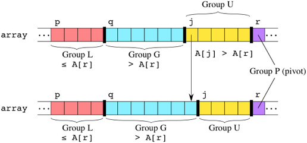
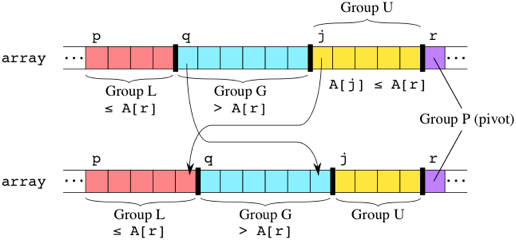
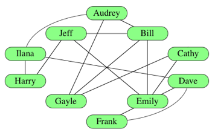

# A Visual Introduction to Algorithms

[toc]


## Intro to Algorithms

Algorithms put "science" into "computer science".

- Compression algorithms
- Route finding algorithms
- Rending algorithms
- Optimization & Scheduling algorithms
- Minimax algorithms

What makes a good algorithm?

1. Correctness
2. Efficiency

Perfect or good enough

Asymptotic analysis

*binary search* for sorted arrays

Route-finding: Start on the goal, keep marking squares in the maze in order of increasing distance from the goal (k->k+1). The program then find a path to the goal by choosing path of decreasing, like going downhill.

## Binary Search

Repeatedly dividing in half the portion of the list

```c++
int binarySearch(vector<int>& arr, int goal) {
    size_t min = 0;
    size_t max = arr.size()-1;
    size_t mid;
    while (min <= max) {
        mid = (min+max)/2;
        if (arr[mid] < goal)
            min = mid + 1;
        else if (arr[mid] > goal)
            max = mid - 1;
        else if (arr[mid] == goal)
            return mid;
    }
    return -1;
}
```

Binary search time complexity: $log_2(n)$

## Asymptotic Analysis

- big-$\Theta$: an asymptotically tight bound on the running time
- big-O: asymptotic upper bounds (may be worse than worst case)
- big-$\Omega$: asymptotic lower bounds (run time at least)

Note that exponential function $a^n$ where (a>1) grows faster than any polynomial $n^b$

big-$\Theta$ notation asymptotically bound the growth of a running time to within constant factors above and below.

Because big-O notation gives only an asymptotic upper bound, and not an  asymptotically tight bound, we can make statements that at first blush  seem incorrect, but are technically correct. For example, it is  absolutely correct to say that binary search runs in **O(n)** time. That's because the running time grows no faster than a constant times n. In fact, it grows slower. 

## Selection Sort

swap function

Find minimum in subarray

Selection sort time complexity: $\Theta(n^2)$

## Insertion Sort

Sum up the running times for insertion sort:

- worst case: $\Theta(n^2)$
- Best case: $\Theta(n)$
- Average case for random array: $\Theta(n^2)$
- "Almost sorted" case: $\Theta(n)$

note: the worst case for insertion sort is a reverse-sorted array

## Recursion Algorithms

base case and recursive case

basic idea behind recursive algorithms: To solve a problem, solve a subproblem that is a smaller instance of the problem, and then use the solution to that smaller instance to solve the original problem

is a string palindrome

```c++
bool isPalindrome(std::string str) {
  // base case #1
  if (str.size() == 0 || str.size() == 1)
    return true;

  // base case #2
  if (str[0] != str[str.size()-1])
    return false;

  // recursive case
  return isPalindrome(str.substr(1, str.size()-2));
}
```

## Towers of Hanoi

Solve the towers of Hanoi recursively.

- n == 1, move 1
- n >= 2
  - recursively solve the subproblem of moving disks 1 through n-1 to spare peg
  - move disk n (biggest) to the desired peg
  - recursively solve the subproblem of moving disks 1 through n-1 from spare peg to the desired peg
- $2^n-1 = (2^{n-1}-1)*2+1$

```c++
// two helper functions.
// 1) moveDisk(fromPeg, toPeg);
//    It moves the top disk from the fromPeg to the toPeg.
// 2) getSparePeg(fromPeg, toPeg);
//    It returns the remaining peg.
void moveDisk(int fromPegId, int toPegId);
int getSparePeg(int peg1, int peg2);

void solveHanoi(int disks, int fromPeg, int toPeg) {
    if (disks == 0)
        return;
    if (disks == 1)
        moveDisk(fromPeg, toPeg);
    if (disks > 1) {
        int sparePeg = getSparePeg(fromPeg, toPeg);
        solveHanoi(disks-1, fromPeg, sparePeg);
        moveDisk(fromPeg, toPeg);
        solveHanoi(disks-1, sparePeg, toPeg);
    }
}
```

## Merge Sort


Both merge sort and quicksort uses the paradigm, divide-and-conquer, which based on recursion to break a problem into subproblems that are similar to the original problem, recursively solves the subproblems and finally combines the solution to the subproblems to solve the original problem.

divide, conquer and combine

```c++
// Takes in an array and recursively merge sorts it
void mergeSort(vector<int>& array, int p, int r) {
    if (p < r) {
        int mid = p + (r-p)/2;
        mergeSort(array, p, mid);
        mergeSort(array, mid+1, r);
        //merge(&array[0], p, mid, r);
        merge(array, p, mid, r);
    }
};
```

Linear-time merging

$\Theta(n)$ when merging n elements

```c++
void merge(vector<int>& array, int p, int q, int r) {
    int i, j, k;
    int n1 = q-p+1;
    int n2 = r-q;
	
    // create left, right temp arrays and copy array data [p, q], [q+1, r]
    int L[n1], R[n2];
    for (i = 0; i < n1; ++i)
        L[i] = array[p+i];
    for (j = 0; j < n2; ++j)
        R[j] = array[q+1+j];

    // compare and copy back to array
    i = 0;
    j = 0;
    k = p;

    while (i < n1 && j < n2) {
        if (L[i] <= R[j]) {
            array[k] = L[i];
            i++;
        }
        else {
            array[k] = R[j];
            j++;
        }
        k++;
    }
    
    // copy the remaining elements of L, if there are any
    while ( i < n1) {
        array[k] = L[i];
        i++;
        k++;
    }
    // copy the remaining elements of R, if there are any
    while (j < n2) {
        array[k] = R[j];
        j++;
        k++;
    }
}
```

Computer scientists draw trees upside-down from how actual trees grow. A tree is a graph with no cycles (paths that start and end at the same place). Convention is to call the vertices in a tree its nodes.

Running time of $\Theta(n lg n)$

Note, during merging, the entire array being sorted are copied and merge sort does not work in place.

## Quick Sort

Like merge sort, quicksort uses divide-and-conquer, and so it's a recursive algorithm. The way that quicksort uses divide-and-conquer is a little different from how merge sort does. In merge sort, the divide step does hardly anything, and all the real work happens in the combine step. Quicksort is the opposite: all the real work happens in the divide step. In fact, the combine step in quicksort does absolutely nothing.

Quicksort works in place. And its worst-case running time is as bad as selection sort and insertion sort: $\Theta(n^2)$; but average-case running time is $\Theta(n lgn)$. The constant factor hidden in the big-$\Theta$ notation for qicksort is quite good. In practice, quicksort outperforms merge sort, and it significantly outperforms selection sort and insertion sort.

1. Partitioning the array using the rightmost element as the pivot such that all elements that are less than or equal to the pivot are to its left
2. Conquer by recursively sorting the left and right sub-arrays
3. Combine by doing nothing

Base case is subarray of size 0 or 1. In merge sort, you never see a subarray with no elements, but it is possible in quicksort.

```c++
void quickSort(vector<int>& array, int p, int r) {
    if (p < r) {
        // pivot is partitioning index, array[pivot] is now at right place
        int pivot = partition(array, p, r);
        quickSort(array, p, pivot-1);
        quickSort(array, pivot+1, r);
    }
};
```

Linear-time partitioning

The real work of quicksort happens during the divide step, which partitions subarray around a pivot. We can choose any element in the subarray as the pivot, but in practice, we usually choose the rightmost element as the pivot for easy implementation.

We maintain two indices q and j into the subarray that divide it up into four groups.

- The elements in array [p, q-1] are "group L", consisting of elements known to be less than or equal to the pivot
- The elements in array [q, j-1] are "group G", consisting of elements known to be greater than the pivot
- The elements in array [j, r-1] are "group U", consisting of elements whose relationship to the pivot is unknown, because they have not yet been compared
- The elements in array [r] is "group P", the pivot



Initially, j==q==p. At each step, we compare A[j], the leftmost element in group U with the pivot. If A[j] is greater than the pivot, then we just **increment j**, so that the line dividing group G and U slides over one position to the right.



If instead A[j] is less than or equal to the pivot, then we **swap A[j] with A[q]**  (the leftmost element in Group G), **increment j, and increment q**, thereby sliding the line dividing group L and G and the line dividing groups G and U over one position to the right. (note: swap means the sorting is unstable?)

Once we get to the pivot, group U is empty. We swap the pivot with the leftmost element in group G (**swap A[r] with A[q]**). This swap puts the pivot between L and G, and it does the right thing even if group L or group G is empty. (If group L is empty, then q never increased from its initial value of p, and so the pivot moves to the leftmost position in the subarray. If group G is empty, then q was incremented every time j was, and so once j reaches the index r of the pivot, q equal r, and the swap leave the pivot if the rightmost position of the subarray.) The partition function that implements this idea also returns the index q where it ended up putting the pivot, so that the quicksort function, which calls it, knows where the partitions are.

- Each element A[j] is compared once with the pivot
- A[j] may or may not be swapped with A[q], q may or may not be incremented (happens when less, equal)
- j is always incremented

The time to partition is $\Theta(n)$: linear-time partitioning

```c++
int partition(vector<int>& array, int p, int r) {
    // Compare array[j] with array[r], for j = p, p+1,...r-1
    // maintaining that:
    //  array[p..q-1] are values known to be <= to array[r]
    //  array[q..j-1] are values known to be > array[r]
    //  array[j..r-1] haven't been compared with array[r]
    // If array[j] > array[r], just increment j.
    // If array[j] <= array[r], swap array[j] with array[q],
    //   increment q, and increment j.
    // Once all elements in array[p..r-1]
    //  have been compared with array[r],
    //  swap array[r] with array[q], and return q.
    int pivot = array[r];
    int q = p, j = p;

    for (j = p; j <r; ++j) {
        if (array[j] <= pivot) {
            swap(array, j, q);
            q++;
        }  // no else needed here; j increment is what is needed
    }
    swap(array, r, q);

    return q;
}
```

Analysis of quicksort

As in merge sort, the time for a given recursive class on an n-element subarray is $\Theta(n)$. In merge sort, that was the time for merging, but in quick sort it's the time for partitioning.

- Worst-case running time: the pivot chosen is either the smallest or largest. When quicksort always have the most unbalanced partitions possible, the total partitioning time is $\Theta(n^2)$: $cn + c(n-1) + c(n-2) + ... + 2c = c/2*(n-2)(n+1)$
- Best-case running time: occurs when the partitions are as evenly balanced as possible. The running time: $\Theta(nlgn)$
- Average-case running time: needs some mathematical skills to get that the average-case running time is also $\Theta(nlgn)$. example of a 3-to-1 split. $log_{4/3}n = lgn/lg(4/3)$; longer but the running time is still $\Theta(nlgn)$

Randomized quicksort: randomly choose an element as the pivot instead of the rightmost (if swap with the current rightmost element, then it's the same as earlier analysis).

We can improve the chance of getting a split that's at worst 3-to-1. Randomly choose 3 elements as pivot candidates and select the *median*

## Graphs



The social network is a **graph**. The names are the **vertices** of the graph. Each line is an **edge**, connecting two vertices. The above graph is **undirected** with pair (u, v) equivalent to (v, u). There are **directed graphs** as well. The vertices connected by an edge are **adjacent** or **neighbors**. The number of edges incident on a vertex is the **degree** of the vertex. We call a **path** between two vertices with the fewest edges a **shortest path**. With a path goes from a particular vertex back to itself, that a **cycle**. The number we put on an edge is its **weight**, and a graph with weighted edges is a **weighted graph**. We call a directed graph with no cycles, a **directed acyclic graph** or **DAG**. The order of the vertices in the directed edge pairs matters. The number of edges leaving a vertex is its **out-degree** and the number of edges entering is the **in-degree**.

Notation for graph sizes: e.g. $\Theta(V)$, $\Theta(lgE)$

Graph representation

- Edge lists
- Adjacency matrix

For a graph with $\mid V\mid$ vertices, an adjacency matrix is a $\mid V\mid*\mid V \mid$ matrix of 0s or 1s (or edge weights). For an undirected graph, the adjacency matrix is *symmetric*

- Adjacency lists

adjacency lists combines adjacency matrices with edge lists. For each vertex i, store an array of vertices adjacent to it. If the graph is weighted, then each item in the adjacency list is either a two-item array or an object, giving the vertex number and the edge weight.

Adjacency lists takes $2\mid E \mid$ space for undirected graph, and $\mid E \mid$ for directed graph

## Breadth-first Search

BFS finds shortest paths from a given source vertex to all other vertices, in terms of the number of edges in the paths. e.g. the Oracle of Bacon web maintains an undirectional graph in which each vertex corresponds to an actor or actress, and if two people appeared in the same film, then there is an edge incident on their vertices. A breath-first search from the vertex for Kevin Bacon finds the shortest chain to all other actors (within 6 steps).

Breadth-first search assigns two values to each vertex:

1. A **distance**, giving the minimum number of edges in any path from the source vertex to vertex v
2. The **predecessor** vertex of v along some shortest path from the source vertex. The source vertex's predecessor is some special value, such as *null*, indicating that it has no predecessor.

always visiting all vertices at distance k from the source before visiting any vertex at distance k+1. visit only the neighbors whose distance is currently *null*. Use a **queue** to keep tracker of vertices that have already been visited but have not yet been visited from.


