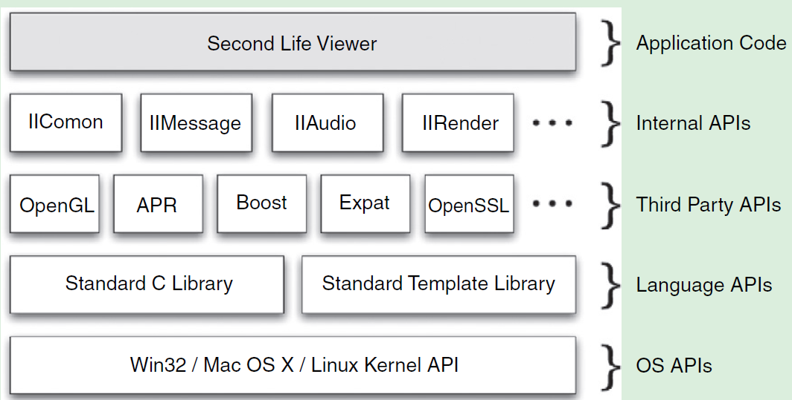

# API Design for C++

[toc]

Interfaces are the most important code that you write because a problem with your interface is far more costly to fix than a bug in your implementation.

## Introduction

An API is a logical interface to a software component that hides the internal details required to implement it.

A C++ API includes

1. Headers: define interface; (source .cpp for open source APIs)
2. Libraries: static (.lib, .a) or dynamic library (.dll, .so) for implementation
3. Documentation: automatically generated

e.g. Window API (Wind32 API)

Must strive for backward compatibility whenever changing an API.

> An API describes software used by other engineers to build their applications. As such, it must be well-designed, documented, regression tested, and stable between releases.

Layers of APIs

- OS APIs: low-level APIs, e.g. Win32
- Langue APIs: STL
- Image APIs: libjpeg, libtiff, libpng libraries
- Three-Dimensional Graphics APIs: OpenGL and DirectX. 3D games will work on various graphics cards because each graphics card manufacture distributes drivers that provide the implementation details behind the OpenGL and DirectX API.
- Graphical User Interface APIs: wxWidgets, Qt, GTK+

Architecture diagram for the second life viewer

> APIs and SDKs: Essentially SDK is platform specific package that you install on your computer in order to build applications against one or more APIs.

File formats, network protocols (client/server, peer-to-peer, middleware services over a network socket) are conceptually similar to an API.

> Whenever you create a file format or client/server protocol, you should also create an API for it. This allows details of the specification, and any further changes to it, to be centralized and hidden

## Qualities

Model the problem domain; provide a good abstraction

Unified Modeling Language (UML)

UML class diagrams: UML specification defines a collection of visual notations to model object-oriented software systems. A single class is represented with a box that is segment into three parts:

1. Upper section contains the class name
2. Middle section lists attributes of the class
3. Lower section enumerates methods of the class

For class attributes and methods, use symbols to indicate access level:

- +indicates public
- -indicates private
- #indicates protected

Relationships between classes:

- *Association*: A 

## Patterns

## Design

## Styles

## Usage

## Performance

## Versioning

## Documentation

## Testing

## Scripting

## Extensibility

## Libraries

## Appendix

### DLLs

In Windows, a dynamic-link library (DLL) is a kind of executable file that acts as a shared library of functions and resources, which enables an executable to call functions or use resources stored in a separate file. The OS can load the DLL into an application's memory space when the application is loaded (*implicit linking*), or on demand at runtime (*explicit linking*). Multiple applications can access the contents of a single copy of a DLL in memory at the same time.

Differences between dynamic linking and static linking

- Static linking copies all the object code in a static library into the executables that use it when they are built.
- Dynamic linking includes only the information needed by Windows at run time to locate and load the DLL that contains a data item or function. When you create a DLL, you also create an import library that contains  this information. When you build an executable that calls the DLL, the  linker uses the exported symbols in the import library to store this  information for the Windows loader. When the loader loads a DLL, the DLL is mapped into the memory space of your application. If present, a  special function in the DLL, `DllMain`, is called to perform any initialization the DLL requires.

Differences between applications and DLLs

- An application can have multiple instances of itself running in the  system simultaneously, whereas a DLL can have only one instance.
- An application can be loaded as a process that can own things such as a  stack, threads of execution, global memory, file handles, and a message  queue, but a DLL cannot.

When your applications use common functions in a DLL, then as long as  the function arguments and return values do not change, you can  implement bug fixes and deploy updates to the DLL. When DLLs are  updated, the applications that use them do not need to be recompiled or  relinked, and they make use of the new DLL as soon as it's deployed.

Dynamic linking makes it easier to support applications written in  different programming languages. Programs written in different  programming languages can call the same DLL function as long as the  programs follow the function's calling convention. The programs and the  DLL function must be compatible in the following ways: the order in  which the function expects its arguments to be pushed onto the stack,  whether the function or the application is responsible for cleaning up  the stack, and whether any arguments are passed in registers.

