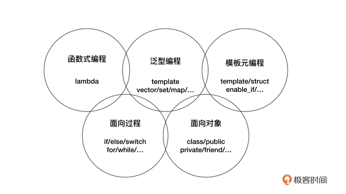
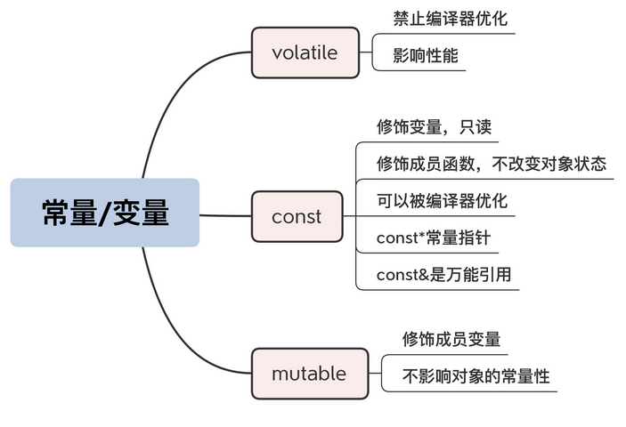

# C++ 实战笔记

[toc]

## 1. 课前导读

重点是谈使用时的注意事项和经验教训。

课程分为5个模块，注重语言和库的“开发落地”，基本不讲语法细节和内部实现原理，用实例促使更多地应用“现代C++”自然、直观的思维方式。

- 概论：生命周期和编程范式
- 语言特性：自动类型推导、智能指针、Lamdba表达式
- 标准库：字符串、容器、算法和并发
- 技能进阶：第三方工具，序列化、网络通信和性能分析
- 总结：设计模式，完整可用的C++服务端程序

勉言：

- 任何人都能写出机器能看懂的代码，但只有优秀的程序员才能写出人能看懂的代码。
- 有两种写程序的方式：一种是把代码写得非常复杂，以至于“看不出明显的错误”；另一种是把代码写得非常简单，以至于“明显看不出错误”。
- “把正确的代码改快速”，要比“把快速的代码改正确”，容易得太多。

C++/Python混合编程，C++写底层代码，Python调用。


建议使用Linux。目前差不多所有的商业网站的服务器（还有Android）上跑的都是Linux，C++再开发后台服务方面可以大显身手。

居然不会CMake？

## 2. 概论

从“生命周期”和“编程范式”的角度来“剖析”C++

### 重新认识C++：生命周期和编程范式 

Coding, Pre-processing, Compiling and Running

预处理是C/C++程序独有的阶段 #

“模板元编程”


现代C++支持“面向过程”、“面向对象”、“范式”、“模板元”、“函数式”这五种编程范式。



面向对象：高内聚低耦合，核心思想是“抽象”和“封装”

泛型编程：核心思想是“一切皆为类型”，使用模板而不是继承的方式来复用代码，运行效率更高，代码也更简洁；STL

模板元编程：核心思想是“类型运算”，操作的数据是编译时可见的“类型”，代码只能由编译器执行，而不能被运行时的CPU执行。更多的以库的方式来使用

函数式：数学意义上、无副作用的函数，核心思想时“一切皆可调用”，通过一系列连续或这嵌套的函数调用实现对数据的处理。

适当混用：常用范式“过程+对象+泛型”，少量“函数式”，慎用“模板元”

C++不是纯粹的面向对象语言，它是面向对象的探路先锋，走了一些弯路，给后来的Java等蹚了道；我们完全可以在C++里按照Java的风格来写面向对象。


面向对象和基于对象有什么区别？

广义上都属于面向对象。前者强调统一用对象建模，多应用设计模式，对象关系复杂。后者相当于C with class，只把class当成struct来封装数据，继承、多态等高级特性用的比较少。


C++的应用水平取决于团体的整体水平。

typedef是在编译阶段，而不是预处理阶段

编译成机器码，但这并不是跨平台的代码，而是源码可以跨平台，由不同的编译器编译成对应平台的二进制代码。
Java等语言的字节码由于运行在虚拟机上，它才是跨平台的代码。

docker用的是go。C++可以让你理解底层计算机的运行机制，反而让你在上层更好地工作。而且C++很容易编写各种底层模块给上层调用，做混合编程里最核心最要求性能的那部分。

### 编码阶段能做什么：秀出好的code style

human readable

空格与空行：留白的艺术

起个好名字

- “匈牙利命名法” - 基本被淘汰
- “CamelCase" - popular in Java
- "snake_case" - C/C++

命名长度一个普遍认可的原则：变量/函数的名字长度与它的作用域成正比；局部可以短一点，全局名应该长一点。

注释：适当注释，一个突出的反例十四JSON，没有注释功能。参考Javadoc

Doxgen：支持从源码生成完整的API文档，但是格式过于“死板”。

注释另一个功能是TODO

“必杀技”：code review

检查C++代码风格的工具：cpplint。它是一个Python脚本

clang-format

```bash
sudo pip install cpplint
```

函数的注释如果是API，写在声明，如果是内部用，写在定义处。


### 预处理阶段能做什么：宏定义和条件编译      

#### 预处理编程：#include, #define

记住：预处理阶段编程的操作目标是“源码”，用各种指令控制预处理器，把源码改造成另一种形式。虽然都在一个源文件里，但预处理不属于C++语言，它走的是预处理器，不受C++语法规则的约束。

#include可以不做检查的包含任意的文件（不限于“头文件”）

#include可以编写一些代码片段，存进“.inc”文件里，然后有选择的加载。用得好的话，可以实现“源码级别的抽象”。

```c++
static uint32_t calc_table[] = { // 非常大的一个数组，有几十行
    0x00000000, 0x77073096, 0xee0e612c, 0x990951ba,
    0x076dc419, 0x706af48f, 0xe963a535, 0x9e6495a3,
    0x0edb8832, 0x79dcb8a4, 0xe0d5e91e, 0x97d2d988,
    0x09b64c2b, 0x7eb17cbd, 0xe7b82d07, 0x90bf1d91,
    ...
};

static uint32_t calc_table[] = {
#	include "calc_values.inc" // 非常大的一个数组，细节被隐藏
};
```


#define可谓“无所不能”，在预处理阶段可以无视C++语法限制，替换任何文字，定义常量/变量,实现函数功能，为类型起别名（typedef），减少重复代码...。但是，使用宏的时候一定要谨慎，时刻记着以简化代码、清晰易懂为目标，不要“滥用”。

注意事项：

- 首先，因为宏的展开、替换发生在预处理阶段，不涉及函数调用、参数传递、指针寻址，没
  有任何运行期的效率损失，所以对于一些调用频繁的小代码片段来说，用宏来封装的效果比
  inline 关键字要更好，因为它真的是源码级别的无条件内联。

  ```c++
  // 示例来自Nginx
  #define ngx_tolower(c) ((c >= 'A' && c <= 'Z') ? (c | 0x20) : c)
  #define ngx_toupper(c) ((c >= 'a' && c <= 'z') ? (c & ~0x20) : c)
  #define ngx_memzero(buf, n) (void) memset(buf, 0, n)
  ```

- 其次，你要知道，**宏是没有作用域概念的，永远是全局生效**。所以，对于一些用来简化代
  码、起临时作用的宏，最好是用完后尽快用“#undef”取消定义，避免冲突的风险

  ```c++
  #define CUBE(a) (a) * (a) * (a) // 定义一个简单的求立方的宏
  cout << CUBE(10) << endl; // 使用宏简化代码
  cout << CUBE(15) << endl; // 使用宏简化代码
  #undef CUBE // 使用完毕后立即取消定义
  ```

  另一种做法是宏定义前先检查，如果之前有定义就先undef，然后再重新定义

  ```c++
  #ifdef AUTH_PWD // 检查是否已经有宏定义
  # undef AUTH_PWD // 取消宏定义
  #endif // 宏定义检查结束
  #define AUTH_PWD "xxx" // 重新宏定义
  ```

- 再次，你可以适当使用宏来定义代码中的常量，消除“魔术数字”“魔术字符串”（magic number）。虽然不少人认为，定义常量更应该使用 enum 或者 const，但我觉得宏定义毕竟用法简单，也是源码级的真正常量，而且还是从 C 继承下来的传统，用在头文件里还是有些优势的。

  ```c++
  #define MAX_BUF_LEN 65535
  #define VERSION "1.0.18"
  ```

- “文本替换”的功能

  ```c++
  #define BEGIN_NAMESPACE(x) namespace x {
  #define END_NAMESPACE(x) }
  BEGIN_NAMESPACE(my_own)
  ... // functions and classes
  END_NAMESPACE(my_own)
  ```


#### 条件编译（#if/#else/#endif）

通常编译环境都会有一些预定义宏，比如 CPU 支持的特殊指令集、操作系统 / 编译器 / 程序库的版本、语言特性等，使用它们就可以早于运行阶段，提前在预处理阶段做出各种优化，产生出最适合当前系统的源码。

```c++
// __cplusplus 标记了C++的版本号
#ifdef __cplusplus // 定义了这个宏就是在用C++编译
	extern "C" { // 函数按照C的方式去处理
#endif
	void a_c_function(int a);
#ifdef __cplusplus // 检查是否是C++编译
	} // extern "C" 结束
#endif

#if __cplusplus >= 201402 // 检查C++标准的版本号
	cout << "c++14 or later" << endl; // 201402就是C++14
#elif __cplusplus >= 201103 // 检查C++标准的版本号
	cout << "c++11 or later" << endl; // 201103是C++11
#else // __cplusplus < 201103 // 199711是C++98
	# error "c++ is too old" // 太低则预处理报错
#endif // __cplusplus >= 201402 // 预处理语句结束
```


使用“#if 1”“#if 0”来显式启用或者禁用大段代码，要比“/* … */”的注释方式安全得多，也清楚得多

```c++
#if 0 // 0即禁用下面的代码，1则是启用
	... // 任意的代码
#endif // 预处理结束
#if 1 // 1启用代码，用来强调下面代码的必要性
	... // 任意的代码
#endif // 预处理结束
```


小结：

1. 预处理不属于 C++ 语言，过多的预处理语句会扰乱正常的代码，除非必要，应当少用慎
   用；
2. “#include”可以包含任意文件，所以可以写一些小的代码片段，再引进程序里；
3. 头文件应该加上“Include Guard”，防止重复包含；
4. “#define”用于宏定义，非常灵活，但滥用文本替换可能会降低代码的可读性；
5. “条件编译”其实就是预处理编程里的分支语句，可以改变源码的形态，针对系统生成最合适的代码。

> 有的编译器支持指令"#pragma once"，也可以实现“include guard”，但它是非标准的，不推荐使用 - 这个g++, MSVC都支持
>
> C++20新增了“模块”(module)特性，可以实现一次性加载，但"include guard"再短期内还是无可替代的。

条件编译多用在跨平台和高级优化方面，不用当然也可以，但要追求性能极致就必须考虑。

预处理就是文本替换，你要是愿意，用shell、Python也可以处理C++源码来实现。

extern "C" { }是处理编译器的链接符号，保持与C兼容，通常是为了导出外部接口使用的。

预处理就是面向源码编程，调整源码的形态，掌握了这一点就可以让代码更干净整齐。


### 编译阶段能做什么：属性和静态断言

编译阶段生成machine instruction code

编译阶段的特殊性在于，它看到的都是 C++ 语法实体，比如 typedef、using、template、struct/class 这些关键字定义的类型，而不是运行阶段的变量。所以，这时的编程思维方式与平常大不相同。

```c++
// 编译阶段数值计算
template <int N>
struct fib
{
    static const int value = fib<N - 1>::value + fib<N - 2>::value;
};

template <>
struct fib<0> // template specialization
{
    static const int value = 1;
};

template <>
struct fib<1>
{
    static const int value = 1;
};

int main()
{
    cout << fib<2>::value << endl;
    cout << fib<3>::value << endl;
    cout << fib<4>::value << endl;
    cout << fib<5>::value << endl;

    return 0;
}
```

上面的计算是编译阶段完成的！

可以把编译器想象成是一种特殊的“虚拟机”，在上面跑的是只有编译器才能识别、处理的代码。


两个比较容易理解的编译阶段技巧：属性和静态断言

#### 属性（attribute）

C++11, attribute 可以被理解为给变量、函数、类等“贴”上一个编译阶段的“标签”，方便编译器识别处理。

```c++
[[deprecated("deadline:2020-12-31")]] // C++14 or later
int old_func();
```

任何用到这个函数的程序都会在编译时看到这个标签，报出一条警告。当然，程序还是能够正常编译的

#### 静态断言（static _assert）

```c++
assert(i > 0 && "i must be greater than zero");
assert(p != nullptr);
assert(!str.empty());
```

注意，assert 虽然是一个宏，但在预处理阶段不生效，而是在运行阶段才起作用，所以又叫“动态断言”。

static_assert是编译阶段里检测各种条件的“断言”，编译器看到static_assert会计算表达式的值，如果false，会报错，导致编译失败。

```c++
template<int N>
struct fib
{
    static_assert(N >= 0, "N >= 0");
    static const int value =
    	fib<N - 1>::value + fib<N - 2>::value;
};
```

> assert是宏，但是static_assert是专门的关键字，不是宏
>
> static_assert 运行在编译阶段，只能看到编译时的常数和类型，看不到运行时的变量、指针、内存数据等，是“静态”的，所以不要简单地把 assert 的习惯搬过来用。

想要更好地发挥静态断言的为例，还要配合标准库里的"type_traits", 它提供了对应这些概念的各种编译期“函数”

```c++
// 假设T是一个模板参数，即template<typename T>
static_assert(
	is_integral<T>::value, "int");
static_assert(
	is_pointer<T>::value, "ptr");
static_assert(
	is_default_constructible<T>::value, "constructible");
```


小结：

1. “属性”相当于编译阶段的“标签”，用来标记变量、函数或者类，让编译器发出或者不发出警告，还能够手工指定代码的优化方式。
2. 官方属性很少，常用的只有“deprecated”。我们也可以使用非官方的属性，需要加上名字空间限定。
3. static_assert 是“静态断言”，在编译阶段计算常数和类型，如果断言失败就会导致编译错误。它也是迈向模板元编程的第一步。
4. 和运行阶段的“动态断言”一样，static_assert 可以在编译阶段定义各种前置条件，充分利用 C++ 静态类型语言的优势，让编译器执行各种检查，避免把隐患带到运行阶段。


### 面向对象编程：怎样才能写出一个“好”的类？      

“面向对象”仍然是编程界的主流 C++, Java, Python, Go, Rust, Swift...

#### 设计思想

要点是抽象和封装

#### 实现原则

“继承”和“多态”不是核心，只能算是附加品。建议再设计类的时候*尽量少用继承和虚函数* - （不敢苟同，继承要少用，多态是很有益处的）。

如果没有隐含的重用代码也会降低耦合度，让类更独立，更容易理解。
还有，把“继承”切割出去之后，可以避免去记忆、实施那一大堆难懂的相关规则，比如public/protected/private 继承方式的区别、多重继承、纯虚接口类、虚析构函数，还可以绕过动态转型、对象切片、函数重载等很多危险的陷阱，减少冗余代码，提高代码的健壮性。

如果非要用继承不可，那么我觉得一定要控制继承的层次，用 UML 画个类体系的示意图来辅助检查。如果继承深度超过三层，就说明有点“过度设计”了，需要考虑用组合关系替代继承关系，或者改用模板和泛型。

设计模式、重构

少用“嵌套类”，这本来是名字空间该做的事情，用类来实现就有点“越权”了。正确的做法应该是，定义一个新的名字空间，把内部类都“提”到外面，降低原来类的耦合度和复杂度。

#### 编码准则

use "final"

建议你只使用 public 继承，避免使用 virtual、protected

在现代 C++ 里，一个类总是会有六大基本函数：三个构造、两个赋值、一个析构。

=default

=delete

explicit: 因为 C++ 有隐式构造和隐式转型的规则，如果你的类里有单参数的构造函数，或者是转型操作符函数，为了防止意外的类型转换，保证安全，就要使用“explicit”将这些函数标记为“显式”。

#### 常用技巧

##### “委托构造” delegating constructor

传统的init()函数可行，但效率和可读性较差，毕竟不是真正的构造函数。C++11引入了“委托构造”的新特性

```c++
class DemoDelegating final
{
private:
	int a; // 成员变量
public:
    DemoDelegating(int x) : a(x) {}// 基本的构造函数

    DemoDelegating() : // 无参数的构造函数
    	DemoDelegating(0) {}// 给出默认值，委托给第一个构造函数

    DemoDelegating(const string& s) : // 字符串参数构造函数
    	DemoDelegating(stoi(s)) {} // 转换成整数，再委托给第一个构造函数
};
```

##### 成员变量初始化 in-class member initializer

```c++
class DemoInit final // 有很多成员变量的类
{
private:
    int a = 0; // 整数成员，赋值初始化
    string s = "hello"; // 字符串成员，赋值初始化
    vector<int> v{1, 2, 3}; // 容器成员，使用花括号的初始化列表
public:
    DemoInit() = default; // 默认构造函数
    ~DemoInit() = default; // 默认析构函数
public:
    DemoInit(int x) : a(x) {} // 可以单独初始化成员，其他用默认值
};
```

##### 类型别名 Type alias

C++11拓展了using的用法，增加了typedef的功能（格式相反）

```c++
using uint_t = unsigned int; // using别名
typedef unsigned int uint_t； // 等价的typedef
```

```c++
class DemoClass final
{
public:
    using this_type = DemoClass; // 给自己也起个别名
    using kafka_conf_type = KafkaConfig; // 外部类起别名
public:
    using string_type = std::string; // 字符串类型别名
    using uint32_type = uint32_t; // 整数类型别名
    using set_type = std::set<int>; // 集合类型别名
    using vector_type = std::vector<std::string>;// 容器类型别名
private:
    string_type m_name = "tom"; // 使用类型别名声明变量
    uint32_type m_age = 23; // 使用类型别名声明变量
    set_type m_books; // 使用类型别名声明变量
private:
    kafka_conf_type m_conf; // 使用类型别名声明变量
};
```

类型别名让代码规范整齐，而且因为引入了“语法层面的宏定义”，将来在维护时可以随意改换成其他类型。。比如，把字符串改成 string_view（C++17 里的字符串只读视图），把集合类型改成 unordered_set，只要变动别名定义就行了，原代码不需要做任何改动。


小结：

1. “面向对象编程”是一种设计思想，要点是“抽象”和“封装”，“继承”“多态”是衍生出的特性，不完全符合现实世界。
2. 在 C++ 里应当少用继承和虚函数，降低对象的成本，绕过那些难懂易错的陷阱。
3. 使用特殊标识符“final”可以禁止类被继承，简化类的层次关系。类有六大基本函数，对于重要的构造 / 析构函数，可以使用“= default”来显式要求编译器使用默认实现。
4. “委托构造”和“成员变量初始化”特性可以让创建对象的工作更加轻松。
5. 使用 using 或 typedef 可以为类型起别名，既能够简化代码，还能够适应将来的变化。

在C++里，不要再使用"typedef struct {...} xxx;" 的方式来定义结构体，这是传统C的做法，不仅没有必要，而且会造成困惑。

传统的类编写方式时“\*.h + \*.cpp”， 声明与实现分离，但更推荐在一个“\*.hpp”里实现类的全部功能，这样更“现代”。很多开源的现代C++项目都采用了“hpp”的方式，比如Boost。在.h中将类的定义和实现写在一起，是默认所有成员函数都内联了，但是否内联有编译器决定，通常只有小的函数才会内联，大的函数不会。

设计模式更强调对象组合，而不是继承；继承时一种“硬”代码复用，关系比较强，不如组合灵活，建议少用。

## 3. 语言特性

### auto/decltype：为什么要有自动类型推导？

#### 自动类型推导

auto type deduction; C++是静态强类型语言。泛型编程是，手动类型推导尤其麻烦。

```c++
auto f = bind1st(std::less<int>(), 2);
// issues
auto str = "hello";  // 推导为const char[6]
```

除了简化代码，auto还避免了对类型的“硬编码”。把map改为unordered_map，用auto不需要改动后面的代码。

“自动类型推导”实际上和“attribute"一样，是编译阶段的特殊指令，指示编译器去计算类型。

#### auto

auto的类型推导只能用在“初始化”的场合（赋值初始化，初始化列表）。目前的C++标准不允许在类成员变量的初始化使用auto

规则

- auto总是推导出“值类型”，绝不会是“引用”
- auto可以加上const， volatile， \*, &这样的类型修饰符，得到新的类型

#### decltype

auto只能用于初始化，decltype可以“向编译器索取类型”

decltype不仅能够推导出值类型，还能够推导出引用类型，也就是表达式的“原始类型”；auto只会推导出值类型。所以，decltype可以看成是一个真正的类型名。

```c++
int x = 0;
using inter_ptr = decltype(&x);  // int*
using int_ref = decltype(x)&;	 // int&
```

C++14增加了decltype(auto)的形式，既可以精确推导类型，又能像auto一样方便使用。

```c++
int x = 0;
decltype(auto) x1 = (x);	// int&
decltype(auto) x2 = &x;		// int*
decltype(auto) x3 = x1;		// int&
```


在变量声明时应尽量多用auto

C++14，auto能够推导函数返回值，这样在写返回复杂函数时，比如pair, container或iterator，会省事

```c++
auto get_a_set() {
    std::set<int> s = {1, 2, 3};
    return s;
}
```

decltype是auto的高级形式，更侧重于编译阶段的类型计算，所以常用在泛型编程里，获取各种类型，配合typedef或using更方便。

比如，定义函数指针

```c++
// UNIX信号函数的原型，看着就让人晕，你能手写出函数指针吗？
void (*signal(int signo, void (*func)(int)))(int)
// 使用decltype可以轻松得到函数指针类型
using sig_func_ptr_t = decltype(&signal) ;
```

定义类时，auto被禁用了，decltype可以

```c++
class DemoClass final
{
public:
	using set_type = std::set<int>; // 集合类型别名
private:
    set_type m_set; // 使用别名定义成员变量
    // 使用decltype计算表达式的类型，定义别名
    using iter_type = decltype(m_set.begin());
    iter_type m_pos; // 类型别名定义成员变量
};
```


小结

1. “自动类型推导”是给编译器下的指令，让编译器去计算表达式的类型，然后返回给程序员。
2. auto 用于初始化时的类型推导，总是“值类型”，也可以加上修饰符产生新类型。它的规则比较好理解，用法也简单，应该积极使用。
3. decltype 使用类似函数调用的形式计算表达式的类型，能够用在任意场合，因为它就是一个编译阶段的类型。
4. decltype 能够推导出表达式的精确类型，但写起来比较麻烦，在初始化时可以采用decltype(auto) 的简化形式。
5. 因为 auto 和 decltype 不是“硬编码”的类型，所以用好它们可以让代码更清晰，减少后期维护的成本。

C++14新增了后缀"s"，表示standard string， "auto str = "xxx"s 可以推导出std::string

auto和decltype的编译期计算类型过程是一样的，都是得出类型，不会计算表达式，只是一个从初始化里获取表达式，一个自带表达式，这个区别导致了用法的不同。

关于 extern "C": 这个是为了兼容C语言，因为C++编译生成的链接符号与C不一样，用这个就会导出与C一样规则的符号，方便外部库调用。


### const/volative/mutable: 常量/变量究竟是怎么回事

#### const, volatile

从 C++ 程序的生命周期角度来看的话，const和宏定义还是有本质区别的：const 定义的常量在预处理阶段并不存在，而是直到运行阶段才会出现。

准确地说，它实际上是运行时的“变量”，只不过不允许修改，是“只读”的（read only），叫“只读变量”更合适。

```c++
// 需要加上volatile修饰，运行时才能看到效果
const volatile int MAX_LEN = 1024;
auto ptr = (int*)(&MAX_LEN);
*ptr = 2048;
cout << MAX_LEN << endl; // 输出2048
```

最好把 const 理解成 read only（虽然是“只读”，但在运行阶段没有什么是不可以改变的，也可以强制写入），把变量标记成 const 可以让编译器做更好的优化。
而 volatile 会禁止编译器做优化，所以除非必要，应当少用 volatile

#### 基本的const用法

常量引用和常量指针

```c++
int x = 100;
const int& rx = x;
const int* px = &x;
```

const & 被称为万能引用，也就是说，它可以引用任何类型，即不管是值、指针、左引用还是右引用，它都能“照单全收”。

在设计函数的时候，我建议你尽可能地使用它作为入口参数，一来保证效率，二来保证安全。

const用于指针

- const 放在声明的最左边，表示指向常量的指针。这个其实很好理解，指针指向的是一个“只读变量”，不允许修改
- const 在“*”的右边，表示指针不能被修改，而指向的变量可以被修改：

```c++
string name = "uncharted";
const string* ps1 = &name; // 指向常量
*ps1 = "spiderman"; // 错误，不允许修改

string* const ps2 = &name; // 指向变量，但指针本身不能被修改
*ps2 = "spiderman"; // 正确，允许修改
```

#### 与类相关的const用法

```c++
class DemoClass final
{
private:
    const long MAX_SIZE = 256; // const成员变量
    int m_value; // 成员变量
public:
    int get_value() const // const成员函数
    {
    	return m_value;
    }
};
```

编译器确认对象不会变，可以去做更好的优化

#### 关键字mutable

mutable 与 volatile 的字面含义有点像，但用法、效果却大相径庭。volatile 可以用来修饰任何变量，而 mutable 却只能修饰类里面的成员变量，表示变量即使是在 const 对象里，也是可以修改的。- cheating

对属于内部的私有实现细节，外面看不到，变与不变不会改变外界看到的常量性。对于这些有特殊作用的成员变量，你可以给它加上 mutable 修饰，解除 const 的限制，让任何成员函数都可以操作它。

```c++
class DemoClass final
{
private:
	mutable mutex_type m_mutex; // mutable成员变量
public:
    void save_data() const // const成员函数
    {
    	// do someting with m_mutex
    }
};
```

总结：**尽可能多用const，让代码更安全**。这在多线程编程时尤其有用。



const_cast用于去除“常量性”,最好不用

const可以被用来overload成员函数


### smart_ptr 智能指针到底“智能”在哪里？

#### 什么是智能指针

指针是源自 C 语言的概念，本质上是一个内存地址索引，代表了一小片内存区域（也可能会很大），能够直接读写内存。
因为它完全映射了计算机硬件，所以操作效率高，是 C/C++ 高效的根源。当然，这也是引起无数麻烦的根源。

RAII，析构函数

智能指针完全实践了 RAII，包装了裸指针，而且因为重载了 * 和 -> 操作符，用起来和原始指针一模一样

#### unique_ptr

```c++
unique_ptr<int> ptr1(new int(10)); // int智能指针
assert(*ptr1 = 10); // 可以使用*取内容
assert(ptr1 != nullptr); // 可以判断是否为空指针
unique_ptr<string> ptr2(new string("hello")); // string智能指针
assert(*ptr2 == "hello"); // 可以使用*取内容
assert(ptr2->size() == 5); // 可以使用->调用成员函数
```

需要注意的是，unique_ptr 虽然名字叫指针，用起来也很像，但它**实际上并不是指针，而是一个对象**。所以，不要企图对它调用 delete，它会自动管理初始化时的指针，在离开作用域时析构释放内存。

unique_ptr 没有定义加减运算，不能随意移动指针地址

make_unique since C++14

unique_ptr 指针的所有权是“唯一”的，不允许共享，任何时候只能有一个“人”持有它。

unique_ptr 应用了 C++ 的“转移”（move）语义，同时禁止了拷贝赋值，所以，在向另一个 unique_ptr 赋值的时候，要特别留意，必须用 std::move() 函数显式地声明所有权转移。赋值操作之后，指针的所有权就被转走了，原来的 unique_ptr 变成了空指针，新的unique_ptr 接替了管理权，保证所有权的唯一性：

```c++
auto ptr = make_unique<int>(42);
assert(ptr && *ptr == 42);

auto ptr2 = std::move(ptr1);
assert(!ptr1 && ptr2);  // ptr1 == nullptr
```

**尽量不要对unique_ptr执行赋值操作**


#### shared_ptr

shared_ptr与unique_ptr最大不同：它的所有权是可以被安全共享的，也就是说支持拷贝赋值，允许被多个“人”同时持有，就像原始指针一样。

```c++
auto ptr1 = make_shared<int>(42); // 工厂函数创建智能指针
assert(ptr1 && ptr1.unique() ); // 此时智能指针有效且唯一
auto ptr2 = ptr1; // 直接拷贝赋值，不需要使用move()
assert(ptr1 && ptr2); // 此时两个智能指针均有效
assert(ptr1 == ptr2); // shared_ptr可以直接比较
// 两个智能指针均不唯一，且引用计数为2
assert(!ptr1.unique() && ptr1.use_count() == 2);
assert(!ptr2.unique() && ptr2.use_count() == 2);
```

shared_ptr 支持安全共享的秘密在于内部使用了“引用计数”。shared_ptr 具有完整的“值语义”（即可以拷贝赋值），所以，它可以在任何场合替代原始指针，而不用再担心资源回收的问题，比如用于容器存储指针、用于函数安全返回动态创建的对象。

天下没有免费的午餐，引用计数的存储和管理都是成本，这方面是 shared_ptr 不如 unique_ptr 的地方。

在运行阶段，引用计数的变动是很复杂的，很难知道它真正释放资源的时机，无法像 Java、Go 那样明确掌控、调整垃圾回收机制。
你要特别小心对象的析构函数，不要有非常复杂、严重阻塞的操作。一旦 shared_ptr 在某个不确定时间点析构释放资源，就会阻塞整个进程或者线程，“整个世界都会静止不动”

```c++
class DemoShared final // 危险的类，不定时的地雷
{
public:
    DemoShared() = default;
    ~DemoShared() // 复杂的操作会导致shared_ptr析构时世界静止
    {
    	// Stop The World ...
    }
};
```

新的问题：“循环引用”，这在把shared_ptr作为类成员的时候最容易出现

```c++
class Node final
{
public:
    using this_type = Node;
    using shared_type = std::shared_ptr<this_type>;
public:
	shared_type next; // 使用智能指针来指向下一个节点
};
auto n1 = make_shared<Node>(); // 工厂函数创建智能指针
auto n2 = make_shared<Node>(); // 工厂函数创建智能指针
assert(n1.use_count() == 1); // 引用计数为1
assert(n2.use_count() == 1);
n1->next = n2; // 两个节点互指，形成了循环引用
n2->next = n1;
assert(n1.use_count() == 2); // 引用计数为2
assert(n2.use_count() == 2); // 无法减到0，无法销毁，导致内存泄漏
```


要从根本上杜绝循环引用，需要weak_ptr。weak_ptr 顾名思义，功能很“弱”。它专门为打破循环引用而设计，只观察指针，不会增加引用计数（弱引用），但在需要的时候，可以调用成员函数 lock()，获取shared_ptr（强引用）。

```c++
class Node final
{
public:
    using this_type = Node;
    // 注意这里，别名改用weak_ptr
    using shared_type = std::weak_ptr<this_type>;
public:
	shared_type next; // 因为用了别名，所以代码不需要改动
};
auto n1 = make_shared<Node>(); // 工厂函数创建智能指针
auto n2 = make_shared<Node>(); // 工厂函数创建智能指针
n1->next = n2; // 两个节点互指，形成了循环引用
n2->next = n1;
assert(n1.use_count() == 1); // 因为使用了weak_ptr，引用计数为1
assert(n2.use_count() == 1); // 打破循环引用，不会导致内存泄漏
if (!n1->next.expired()) { // 检查指针是否有效
	auto ptr = n1->next.lock(); // lock()获取shared_ptr
    assert(ptr == n2);
}
```

小结：

1. 智能指针是代理模式的具体应用，它使用 RAII 技术代理了裸指针，能够自动释放内存，无需程序员干预，所以被称为“智能指针”。
2. 如果指针是“独占”使用，就应该选择 unique_ptr，它为裸指针添加了很多限制，更加安全。
3. 如果指针是“共享”使用，就应该选择 shared_ptr，它的功能非常完善，用法几乎与原始指针一样。
4. 应当使用工厂函数 make_unique()、make_shared() 来创建智能指针，强制初始化，而且还能使用 auto 来简化声明。
5. shared_ptr 有少量的管理成本，也会引发一些难以排查的错误，所以不要过度使用。

不要再使用raw pointer, new, delete

工厂函数make_unique(), make_shared()不是指返回智能指针对象那么简单，它内部也有优化，通常比手写类型构造的效率更高。

基本的数据结构强调效率，用智能指针就有点成本略高。智能指针最适合的应用场景是“自动资源管理”，链表还是不太合适，而且使用shared_ptr容易出现循环引用。

unique_ptr，效率与裸指针几乎相同，没有引用计数的成本。

unique_ptr不是线程安全的，不要在多线程里用。应该用shared_ptr，但它也只有最基本的线程安全保证，不能完全依赖它

不建议用智能指针管理数组，虽然这样也可以，最好用容器。


### exception: 怎样才能用好异常？

在 C++ 之前，处理异常的基本手段是“错误码”。有一个问题，那就是正常的业务逻辑代码与错误处理代码混在了一
起，看起来很乱。错误码还有一个更大的问题：它是可以被忽略的。

异常就是针对错误码的缺陷而设计的，它有三个特点。

- 异常的处理流程是完全独立的。
- 异常时绝对不能被忽略的，必须被处理。
- 异常可以用在错误码无法使用的场合。比如构造/析构函数，操作符重载

<stdexcept>


最好从第一层或第二层的某个类型作为基类（继承深度不超过三层）。

```c++
class my_exception : public std::runtime_error
{
public:
    using this_type = my_exception; // 给自己起个别名
    using super_type = std::runtime_error; // 给父类也起个别名
public:
    my_exception(const char* msg): // 构造函数
    	super_type(msg) {} // 别名也可以用于构造
    my_exception() = default; // 默认构造函数
    ~my_exception() = default; // 默认析构函数
private:
    int code = 0; // 其他的内部私有数据
};
```

再抛出异常的时候，建议最好不要直接用throw，而是要封装成一个函数 - *通过引入一个“中间层”来获得更多的可读性、安全性和灵活性*

对于多个catch块，异常只能按照catch块在代码里的顺序依次匹配，而不会去找最佳匹配。建议最好只用一个catch块。

C++ little known feature : function-try (never heard about it)

```c++
void some_function()
try // 函数名之后直接写try块
{
...
}
catch(...) // catch块与函数体同级并列
{
...
}
```


异常也是有成本的。异常的抛出和处理需要特别的栈展开(stack unwind)操作。

区分“非”错误，“轻微”错误和“严重”错误，谨慎使用异常。

比如说构造函数，如果内部初始化失败，无法创建，那后面的逻辑也就进行不下去了，所以这里就可以用异常来处理。
再比如，读写文件，通常文件系统很少会出错，总会成功，如果用错误码来处理不存在、权限错误等，就显得太啰嗦，这时也应该使用异常。
相反的例子就是 socket 通信。因为网络链路的不稳定因素太多，收发数据失败简直是“家常便饭”。虽然出错的后果很严重，但它出现的频率太高了，使用异常会增加很多的处理成本，为了性能考虑，还是检查错误码重试比较好。


noexcept 编译阶段指令；“不可靠的承诺”，不是“强保证”

noexcept 的真正意思是：“我对外承诺不抛出异常，我也不想处理异常，如果真的有异常发生，请让我死得干脆点，直接崩溃（crash、core dump）。”


如果你决定使用异常，为了确保出现异常的时候资源会正确释放，就必须禁用裸指针，改成智能指针，用 RAII 来管理内存。

boost.exception

C++d的异常机制里没有保证最终执行代码的finally

一般认为，重要的构造函数（普通构造、拷贝构造、转移构造）、析构函数应该尽量声明为noexcept，优化性能，而析构函数则必须保证绝不会抛异常。

###  lambda：函数式编程带来了什么？

函数式编程

在语法层面上，C/C++ 里的函数是比较特别的。虽然有函数类型，但不存在对应类型的变量，不能直接操作，只能用指针去间接操作（即函数指针），这让函数在类型体系里显得有点“格格不入”。

```c++
void my_square(int x) // 定义一个函数
{
	cout << x*x << endl; // 函数的具体内容
}
auto pfunc = &my_square; // 只能用指针去操作函数，指针不是函数
(*pfunc)(3); // 可以用*访问函数
pfunc(3);
```

C++ 不允许定义嵌套函数、函数套函数。

#### lambda

在面向过程编程范式里，函数和变量虽然是程序里最关键的两个组成部分，但却因为没有值、没有作用域而不能一致地处理。函数只能是函数，变量只能是变量，彼此之间“泾渭分明”。

```c++
auto func = [](int x) {cout << x*x << endl; };
func(3);
```

lambda 表达式与普通函数最大、也是最根本的区别。因为 lambda 表达式是一个变量，所以，我们就可以“按需分配”，随时随地在调用点“就地”定义函数，限制它的作用域和生命周期，实现函数的局部化。

lambda 表达式为 C++ 带来的变化可以说是革命性的。虽然它表面上只是一个很小的改进，简化了函数的声明 / 定义，但深层次带来的编程理念的变化，却是非常巨大的。lambda 引出的全新思维方式就是“函数式编程” - 把写计算机程序看作是数学意义上的求解函数。

lambda可以“捕获”外部变量。Javascript "闭包" closure


```c++
auto f = [](){} ;  // 相当于空函数
```

lambda可以嵌套。

在 C++ 里，每个 lambda 表达式都会有一个独特的类型，而这个类型只有编译器才知道，我们是无法直接写出来的，所以必须用 auto。鼓励“匿名”使用


变量捕获

- “[=]”表示按值捕获所有外部变量，表达式内部是值的拷贝，并且不能修改；
- “[&]”是按引用捕获所有外部变量，内部以引用的方式使用，可以修改；

外部变量称为”upvalue"：在 lambda 表达式定义之前所有出现的变量，不管它是局部的还是全局的。这有个变量生命周期的问题。

使用“[=]”按值捕获的时候，lambda 表达式使用的是变量的独立副本，非常安全。而使用“[&]”的方式捕获引用就存在风险，当 lambda 表达式在离定义点“很远的地方”被调用的时候，引用的变量可能发生了变化，甚至可能会失效，导致难以预料的后果。


C++14支持泛型的lambda

```c++
auto f = [](const auto& x) // 参数使用auto声明，泛型化
{
	return x + x;
};
cout << f(3) << endl; // 参数类型是int
cout << f(0.618) << endl; // 参数类型是double
string str = "matrix";
cout << f(str) << endl; // 参数类型是string
```

这个新特性在写泛型函数的时候非常方便，摆脱了冗长的模板参数和函数参数列表。尝试在今后的代码里都使用 lambda 来代替普通函数，能够少写很多代码。

比照“智能指针”的说法，lambda 完全可以称为是“智能函数”，价值体现在就地定义、变量捕获等能力上，它也给 C++ 的算法、并发（线程、协程）等后续发展方向铺平了道路。lambda表达式还有个重要的用途是它可以自定义stl函数谓词规则(pred)，例如自定义排序规则，而无需使用传统的仿函数那种麻烦的方法。

用“map+lambda”的方式来替换难以维护的 if/else/switch，可读性要比大量的分支语句好得多。


小结：

1. lambda 表达式是一个闭包，能够像函数一样被调用，像变量一样被传递；可以使用 auto 自动推导类型存储 lambda 表达式，但 C++ 鼓励尽量就地匿名使用，缩小作用域；
2. lambda 表达式使用“[=]”的方式按值捕获，使用“[&]”的方式按引用捕获，空的“[]”则是无捕获（也就相当于普通函数）；
3. 捕获引用时必须要注意外部变量的生命周期，防止变量失效；
4. C++14 里可以使用泛型的 lambda 表达式，相当于简化的模板函数。

每个lambda表达式的类型都是唯一的，所以即使函数签名相同，lambda变量也不能相互赋值。解决办法是使用标准库里的std::function类，它是“函数的容器”“函数只能指针”，可以存储任意符合签名的“可调用物” (callable object)，搭配使用能够让lambda表达式用起来更灵活。

lambda表达式赋值必须用auto，但auto不能用在类成员初始化，所以还不能用作成员函数（遗憾）

lambda超越了早期的函数对象，因为它是“闭包”，所以有着与函数、函数对象完全不同的用法，可以说是一种“高维生物”。

## 4. 标准库

## 5. 技能进阶

## 6. 总结篇

## 7. 结束语

## 8. 轻松话题