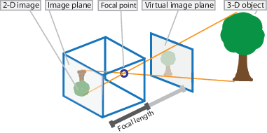
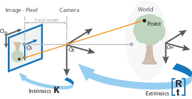
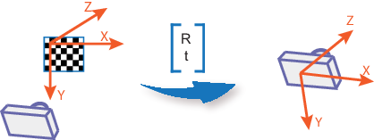
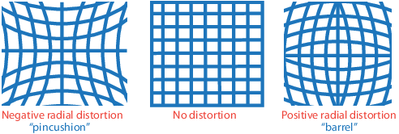

# Computer Vision - General Notes

[toc]

Algorithms, functions for computer vision, 3D vision, and video processing. Perform object detection and tracking, feature detection, extraction, and matching. For 3D vision includes single, stereo, and fisheye camera calibration; stereo vision; 3D reconstruction; and lidar and 3D point cloud processing.

Object detectors using deep learning and machine learning algorithms, such as YOLO v2, Faster R-CNN, and ACF. For sematic segmentation using deep learning algorithms such as SegNet, U-Net, and DeepLab.

Accelerate algorithms by running on multicore processors and GPUs.

## Feature Detection and Extraction

## Deep Learning, Sematic Segmentation and Detection

## Camera Calibration and 3-D Vision

Estimate camera intrinsics, distortion coefficients, and camera extrinsics, extract 3-D information from 2-D images, perform stereo rectification, depth estimation, 3-D reconstruction, triangulation and structure from motion.

- camera calibration: camera intrinscis, extrinsics, and lens distortion parameters
- stereo camera calibration: recover depth from images; estimate parameters of each camera; position and orientation of camera 2 relative to camera 1

### What is Camera Calibration

Geometric camera calibration

- estimate the parameters of a lens and image sensor
- used for 
  - correct lens distortion
  - measure the size of the object in world units
  - determine the location of the camera in the scene

To estimate the camera parameters, need to have 3-D world points and their corresponding 2-D image points. We can get these correspondences using multiple images of a *calibration pattern*, such as  a checkboard. With the correspondences, we can solve the camera parameters. After calibration, we can evaluate the accuracy with

- plot the relative location of the camera and the calibration pattern (checkboard)
- calculate the reprojection errors
- calculate the parameter estimation errors

#### Camera Model

- Pinhole camera model

ideal pinhole camera does not have a lens. 

**Camera Matrix**

- 4-by-3 representing camera parameters

- maps the 3-D world scene into the image plane

- to be identified by the calibration algorithm​ by calculating the extrinsic and intrinsic parameters, where extrinsic parameters represent the location of the camera in the 3-D scene. The intrinsic parameter represent the optical center and focal length of the camera

  ​														$$w*[x, y, 1] = [X, Y, Z, 1]*P$$

  ​																	$$P=\begin{bmatrix}R\\t\end{bmatrix}*K$$

  ​															  $$K = \begin{bmatrix}f_x & 0 & 0\\ s & f_y & 0\\ c_x & c_y & 1\end{bmatrix}$$

where

- w: scale factor
- $[X, Y, Z, 1]$: world points; $[x, y, 1]$: image points
- P: camera matrix; R, t: extrinsic rotation and translation; K: intrinsic matrix
- $[c_x,  c_y]$ - optical center (the principal point), in pixel; $f_x, f_y$ - Focal length in pixels, where $f_x = F/p_x$, $f_y = F/p_y$, where F - Focal length in world in units (mm), $(p_x, p_y)$ - size of pixel in world units; s - skew coefficient, which is non-zero if the image axes are not perpendicular; $s = f_x*tan(\alpha)$, unit (pixel)

The world points are transformed to camera coordinates using the extrinsics parameters. The camera coordinates are mapped into the image plane using the intrinsics parameters. *The extrinsic parameters represent a rigid transformation from 3-D world coordinate system to the 3-D camera coordinate system. The intrinsic parameters represent a projective transformation from the 3-D camera's coordinates into the 2-D image coordinates.

The origin of the camera's coordinate system is at its optical center and its x- and y-axis define the image plane. In a stereo system, the origin is located at the optical center of Camera 1.

The camera intrinsic parameters include focal length, the optical center (aka principal points) and the skew coefficient.

- Lens distortion model (radial and tangential)

The camera matrix does not account for lens distortion. The (accurate) camera model includes the radial and tangential lens distortion.

**Radial Distortion**

Radial distortion occurs when light rays bend more near the edges of a lens than they do at tis optical center. The smaller the lens, the greater the distortion.

The radial distortion coefficients model this type of distortion.

​														$$x_{distorted} = (1+k_1r^2+k_2r^4+k_3r^6)x$$

​														$$y_{distorted} = (1+k_1r^2+k_2r^4+k_3r^6)y$$

where

- $x, y$ - Undistorted pixel locations. $x$ and $y$ are in normalized image coordinates. Normalized image coordinates are calculated from pixel coordinates by translating to the optical center and dividing by the focal length in pixels. Thus $x$ and $y$ are dimensionless
- $k_1, k_2, k_3$ - Radial distortion coefficients of the lens (to be calibrated)
- $r^2=x^2+y^2$

Typically, two coefficients are sufficient for calibration. For severe distortion, such as in wide-angle lenses, we can select 3 coefficients including $k_3$

**Tangential Distortion**

Tangential distortion occurs when the lens and the image plane are not parallel.

​															$$x_{distorted} = x + [2p_1xy+p_2(r^2+2x^2)]$$

​															$$y_{distorted} = y + [p_1(r^2+2y^2)+2p_2xy]$$

where

- $x, y$ - Undistorted pixel locations. $x$ and $y$ are in normalized image coordinates. Normalized image coordinates are calculated from pixel coordinates by translating to the optical center and dividing by the focal length in pixels. Thus $x$ and $y$ are dimensionless
- $p_1, p_2$ - Tangential distortion coefficients of the lens
- $r^2=x^2+y^2$

When you recontruct a 3-D scene using a calibrated stereo camera, the *reconstructScene* and *triangulate* functions return 3-D points with the origin at the optical center of Camera 1.

**Calibration Pattern-Based Coordinate System**

Points represented in a calibration pattern-based coordinate system are described with the origin located at the (0, 0) location of the calibration pattern (e.g. checkerboard).

#### Single Camera Calibrator

## Lidar and Point Cloud Processing

## Tracking and Motion Estimation

