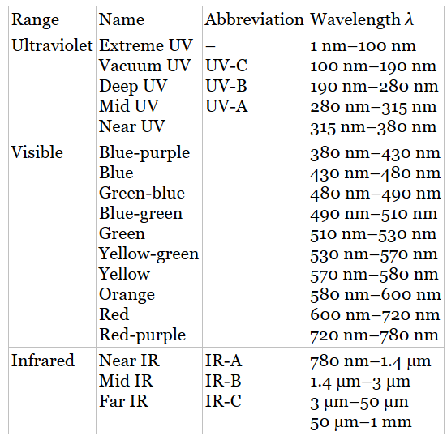

# Machine Vision Algorithms and Applications - 2nd

[toc]

HALCON software (https://www.mvtec.com/products/halcon/) - MVTec

book web (https://www.mvtec.com/company/research/machine-vision-book/)

automation

- camera-computer interface standard
- readily available sensors
- 3D machine vision algorithms
- robotics
- machine learning (classification)

## Introduction

Machine vision is one key technology in manufacturing because of increasing demands on the documentation of quality and the traceability of products. quality inspection, hybrid robot control

Common tasks for machine vision:

- object identification. can be based on special identification symbols, e.g. character strings or bar codes, or on objects characteristics, such as shape
- position detection is used to control a robot assembling a product, such as pick-and-place onto PCB. 2D or 3D
- completeness checking; the right components are in the right place
- Shape and dimension inspection checking the product geometric parameters; tolerance; in production and in use
- surface inspection, e.g. scratches, indentations, protrusions

A typical machine vision system:

- 1) object to be transported and inspected
- 4) a trigger that triggers the image acquisition, e.g. a photoelectric sensor
- 3) illumination
- 2) camera with lens or smart camera with built-in computer
- 5) computer (standard industrial PC); computer may use a standard processor, a DSP, or field-programmable gate array (FPGA) or a combination of above
- 6) camera-computer interface, e.g. a frame grabber
- 7) image assembled in the computer memory
- 8) machine vision software inspects the object and returns
- 9) an evaluation of the object
- 11) the result is communicated to a controller, e.g. a PLC or a distributed control system (DCS)
- this communication is performed by digital I/O interface 10)
- PLC, in turn, typically controls an actuator 13) through 
- a communication interface 12), e.g. a fieldbus or serial interface

If the image is acquired through a frame grabber, then illumination may be controlled by the frame grabber, e.g. through strobe signals. If the camera-computer interface is not a frame grabber but a standard interface, such as IEEE 1394, USB, or Ethernet, the trigger will typically be connected to the camera and illumination directly or through a programmable logic controller (PLC).

ME, EE, OE and SE

## Image Acquisition

hardware components involved

### Illumination

The goal of illumination is to make the important features visible and to suppress undesired features of the object. Spectral composition of the light and the object

#### Electromagnetic Radiation

Light is the electromagnetic radiation of a certain range of wavelengths. The range of wavelengths visible for humans is 380-780 nm.

### Lenses

### Cameras

### Camera-Computer Interfaces

### 3D Image Acquisition Devices

## Machine Vision Algorithms

### Fundamental Data Structures

### Image Enhancement

### Geometric Transformations

### Image Segmentation

### Feature Extraction

### Morphology

### Edge Extraction

### Segmentation and Fitting of Geometric Primitives

### Camera Calibration

### 3D Reconstruction

### Template Matching

### 3D Object Recognition

### Hand-Eye Calibration

### Optical Character Recognition

### Classification

## Machine Vision Applications

### Wafer Dicing

### Reading of Serial Numbers

### Inspection of Saw Blades

### Print Inspection

### Inspection of Ball Grid Arrays

### Surface Inspection

### Measurement of Spark Plugs

### Molding Flash Detection

### Inspection of Punched Sheets

### 3D Plane Reconstruction with Stereo

### Pose Verification of Resistors

### Classification of Non-Woven Fabrics

### Surface Comparison

### 3D Pick-and-Place

## References