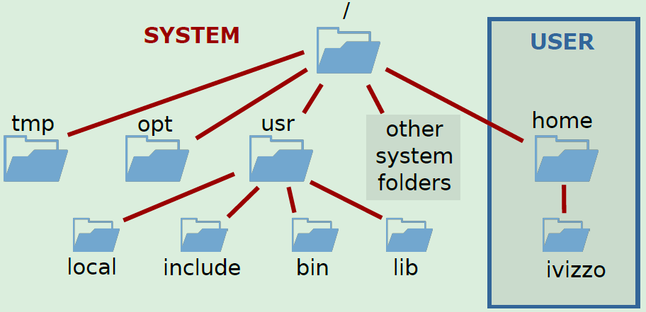
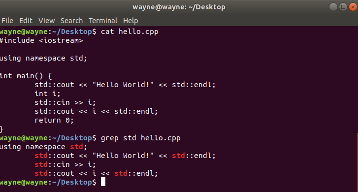

# Modern C++ for Computer Vision and Image Processing

[toc]

https://www.youtube.com/watch?v=F_vIB3yjxaM&list=PLgnQpQtFTOGR50iIOtO36nK6aNPtVq98C

2018 and 2020 versions

http://www.ipb.uni-bonn.de/teaching/modern-cpp/

https://www.ipb.uni-bonn.de/teaching/cpp-2020/

## Course Introduction and Hello World

> Talk is cheap. Show me the code. - Linus Torvalds

### Linux Introduction

Linux directory tree



- Tree organization starting with root: /
- there are no volume letters, e.g. C:, D:
- user can only access his/her own folder

Understanding files and folders

- Folders end with / e.g. /path/folder/
- Everything else are files, e.g. /path/file
- Absolute paths start with / while all other paths are relative
  - /home/folder/  - absolute
  - folder/filer  - relative
- Paths are case sensitive: filename is different from FileName
- extension is part of a name

Linux terminal

- Terminal is faster

- Terminal is always in some folder

- pwd

- cd <dir>

- ls <dir>

- special folders:

  - / - root folder
  - ~ - home folder
  - . - current folder
  - .. - parent folder

- --help

- mkdir

- rm -[r]f: remove [recursive] [force]

- cp [-r] <source><dest> - copy

- mv <source> <dest> - move

- Using placeholders: can be used with most terminal commands: ls, rm, mv

  - \* : Any set of characters

  - ? : Any single character

  - [a-f]: characters in [abcdef]

  - [^a-c]: characters not in [abc]

Standard input/output channels

- stdin
- stdout
- stderr

Working with files

- cat <filename>  -- cool
  - print the contents of the file in the terminal
- grep <what> <where>  -- insanely powerful (probably the most)
  - search for a string <what> in a file <where>



Chaining commands

Linux command line pipes and redirection

Canceling commands

- CTRL+C
- htop (top) -- cool (shows an overview of running processes)

Command histroy

- arrow
- Ctrl+R <query>

Install software

- sudo apt


### C++ Hello World

Modern C++

Good code style is important

- Use *clang_format* to format your code
- use *cpplint* to check the style
- We use Goolge Code Style Sheet

Compilers on Linux

- GCC
- Clang

```c++
c++ -std=c++11 -o hello hello.cpp
```


## Variables, Basic Types, Control Structure

always initialize variables if you can

Naming variables

- `GOOGLE-STYLE`: snake_case
- don't be afraid of long names

use std::array for fixed size collection of items of same type

```c++
array<float, 3> arr = {1.0f, 2.0f, 3.0f};
```

Use std::vector, it is fast and flexible; Vector is implemented as a dynamic table

Add a new item:

- vec.emplace_back(value) [preferred, C++11]
- vec.push_back(value) [historically better known]

Optimize vector resizing

```c++
vec.reserve(kIterNum);
```


Variables live in scopes; this is the core of C++ memory system

- Tip: declare everything const unless it must be changed

- GOOGLE_STYLE names constants in CamelCase starting with a small letter k

```c++
const float kImportFactor = 20.0f;
```

References

- const with references

In C++, for loops are very fast. less flexible than while but less error-prone

use break to exit the loop

### Git

- Free software for distributed version control
- Synchronizes local (computer) and remote files (repository)
- Stores a history of all changes

Typical workflow

- *Cloning* a repository: git clone <repo_url>
- change files
- git add <files>
- git commit -am "descriptive message"
- git push origin master


## Compilation, Debugging, Functions, Header/Source, Libraries, CMake

feed commands into the bash

demo:

```bash
touch commands.sh
# modify commands.sh
subl commands.sh
# echo "hello world"

# either feed commands to the bash
sh commands.sh
# make it executable
chmod +x commands.sh  # chmod: change mode
./commands.sh
```

### Compilation flags and debugging

- -std=c++11
- -Wall, -Wextra, -Werror
- Optimization options: -o0 (no optimizations); -o3 or -ofast (full optimization)
  - Compiler explorer: https://godbolt.org/; check assembly
  - with full optimization, most of your code goes away
- Keep debugging symbols: -g

Debugging tools

- the best option is to use gdb
- insanely popular and powerful
- No build-in gui
- use gdbgui for a user-friendly interface
- install gdbgui from pip: sudo pip3 install --upgrade gdbgui  (# a python program)

### Functions

- `GOOGLE-STYLE` name functions CamelCase
- create a scope
- Function **does a single thing**

Declaration and definition

- Function declaration can be separated from the implementation details
- Declaration sets up an interface
- Definition holds the implementation of the function that can be hidden from the user

use `const` reference; `GOOGLE-STYLE` Avoid using non-const refs

use snake_case for all function arguments

Function overloading

- cannot overload based on return type
- `GOOGLE-STYLE` Avoid non-obvious voerloads

Default arguments

- Only set in declaration not in definition
- Evaluated upon every call
- `GOOGLE-STYLE` Only use when readability gets much better

Don't reinvent the wheel

```c++
std::sort(v.begin(), v.end());
float sum = std::accumulate(v.begin(), v.end(), 0.0f);
float product = std::accumulate(v.begin(), v.end(), 1.0f, std::multiplies<float>());
```

### Header/Source Separation

```c++
#pragma once
```

we separate the code into modules. How to build this?

hard to build by hand. Use modules and libraries

- Compile modules

```c++
c++ -std=c++11 -c tools.cpp -o tools.o
```

- Organize modules into libraries

```c++
ar rcs libtools.a tools.o <other modules>
```

- Link libraries when building code

```c++
c++ -std=c++11 main.cpp -L . -ltools -o main
```

- Run the code

```bash
./main
```

### Libraries

- Library: multiple object files that are logically connected
- Types of libraries:
  - **Static**: faster, take a lot of space, become part of the end binary, named: lib*.a
  - **Dynamic**: slower, can be copied, referenced by a program, named lib*.so
- Create a static library with

```c++
ar rcs libnames.a module.o module.o ...
```

- Static libraries are just archives just liek zip/tar/...

What is linking?

- The library is a binary object that contains the compiled implementation of some methods
- Linking maps a function declaration to its compiled implementation
- To use a library we need *a header and the compiled the library* object


### CMake introduction

Use CMake to simplify the build

- One of the most popular build tools (build generator)
- Does not build the code, generates files to feed into a build system
- Cross-platform
- Very powerful, still build receipt is readable
- The library creation and linking can be rewritten as follows:

```cmake
add_library(tools tools.cpp)
add_executable(main main.cpp)
target_link_libraries(main tools)
```

#### Typical Project Structure


we usually separate include/ from src/ folder

#### Build Process

- CMakeLists.txt defines the whole build
- CMake reads CMakeLists.txt sequentially
- Build process:
  - cd <project_folder>
  - mkdir build
  - cd build
  - cmake ..
  - make -j4 # pass your number of cores here

Working CMakeLists.txt

```cmake
project(first_project)              # Mandatory
cmake_minimum_required(VERSION 3.1) # Mandatory
set(CMAKE_CXX_STANDARD 11)

# tell cmake to output binaries here:
set(EXECUTABLE_OUTPUT_PATH ${PROJECT_SOURCE_DIR}/bin)
set(LIBRARY_OUTPUT_DIRECTORY ${PROJECT_SOURCE_DIR}/LIB)

# tell cmake where to look for *.h files
include_directories(include)

# create library "libtools"
add_library(tools src/tools.cpp)

# add executable main
add_executable(main src/tools_main.cpp)

# tell the linker to bin these projects together
target_link_libraries(main tools)
```

