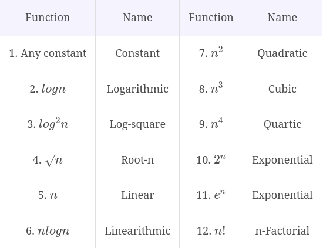

# Data Structures in C++: An Interview Refresher

[toc]

## Introduction to Complexity Measures

time and space

primitive operation

- Best case analysis - lower bound of execution time
- Worst case analysis - upper bound of execution time
- Average case analysis - compute the weighted average of the number of operations with the relative frequencies

time complexity

Asymptotic analysis and Big O

cares about large input sizes only

A function $f(n)$ is considered $O(g(n))$ if there exists some positive real constant c and an integer $n_0\geq 0$ such that the following inequality holds for all $n \geq n_0$: $f(n) \leq cg(n)$

$O(g(n))$ is a set of functions

When dealing with time and space complexities, we are generally interested in the tightest possible bound when it comes to the asymptotic notation.

