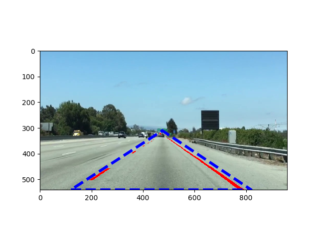
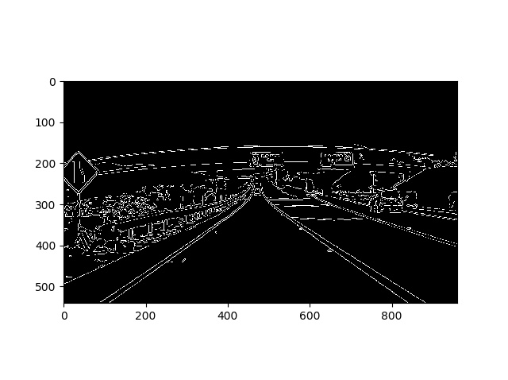
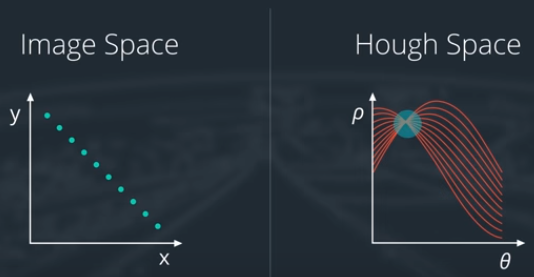
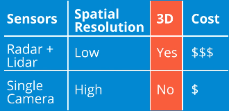

# Self-Driving Car Engineer

[toc]

Projects

- Finding Lane Lines
- Advanced Lane Finding
- Traffic Sign Classifier
- Behavioral Cloning
- Extended KF
- Kidnapped Vehicle
- Highway Driving
- PID Controller
- LinkedIn, Github profiles
- Programming a Real Self-Driving Car

## Part 1. Computer Vision, Deep Learning, and Sensor Fusion

### Introduction; 

Robotics approach and Deep learning approach

Stanley; DARPA Grand Challenge

### Computer Vision Fundamentals

vision perception; 

The following features could be useful in the identification of lane lines on the road

- Color
- Shape
- Orientation
- Position in the image

RGB channels; 0: darkest, 255: white; pure while: [255, 255, 255]


#### Color Selection

modify the threshold values until retain as much of the lane lines as possible while dropping everything else

```python
import matplotlib.pyplot as plt
import matplotlib.image as mpimg
import numpy as np

# read image
image = mpimg.imread("../../Media/laneOrg.jpg")
print("this iamge is: ", type(image),
      "with dimension: ", image.shape)  # (nrow, ncol, 3)

xsize = image.shape[1]
ysize = image.shape[0]

color_select = np.copy(image)

red_threshold = 200
green_threshold = 200
blue_threshold = 200
rgb_threshold = [red_threshold, green_threshold, blue_threshold]
# print(type(rgb_threshold))

# pixels below the threshold
thresholds = (image[:, :, 0] < rgb_threshold[0]) \
    | (image[:, :, 1] < rgb_threshold[1]) \
    | (image[:, :, 2] < rgb_threshold[2])
print(type(thresholds), '\t', thresholds.shape)
color_select[thresholds] = [0, 0, 0]

plt.imshow(color_select)
plt.show()

# mpimg.imsave("../../Media/laneSelected.jpg", color_select)
```


#### Region Masking

Assuming that the front facing camera that took the image is mounted in a fixed position on the car, such that the lane lines will always appear in the same general region of the image. We are using a triangular mask for illustration, in principle, we could use any polygon.

```python
import matplotlib.pyplot as plt
import matplotlib.image as mpimg
import numpy as np

# read image
image = mpimg.imread("../../Media/laneOrg.jpg")
print("this iamge is: ", type(image),
      "with dimension: ", image.shape)  # (nrow, ncol, 3)

xsize = image.shape[1]
ysize = image.shape[0]

color_select = np.copy(image)
line_image = np.copy(image)

red_threshold = 200
green_threshold = 200
blue_threshold = 200
rgb_threshold = [red_threshold, green_threshold, blue_threshold]
# print(type(rgb_threshold))

# Define a triangle region of interest
left_bottom = [120, 540]
right_bottom = [820, 540]
apex = [475, 310]

fit_left = np.polyfit((left_bottom[0], apex[0]), (left_bottom[1], apex[1]), 1)
fit_right = np.polyfit(
    (right_bottom[0], apex[0]), (right_bottom[1], apex[1]), 1)
fit_bottom = np.polyfit(
    (left_bottom[0], right_bottom[0]), (left_bottom[1], right_bottom[1]), 1)

# mask pixels below the threshold
color_thresholds = (image[:, :, 0] < rgb_threshold[0]) \
    | (image[:, :, 1] < rgb_threshold[1]) \
    | (image[:, :, 2] < rgb_threshold[2])

# find the region inside the triangle
XX, YY = np.meshgrid(np.arange(0, xsize), np.arange(0, ysize))
region_thresholds = (YY > (XX*fit_left[0] + fit_left[1])) & \
    (YY > (XX*fit_right[0] + fit_right[1])) & \
    (YY < (XX*fit_bottom[0] + fit_bottom[1]))

color_select[color_thresholds] = [0, 0, 0]
# find where the image is both colored right and in the region
line_image[~color_thresholds & region_thresholds] = [255, 0, 0]

plt.imshow(image)
x = [left_bottom[0], right_bottom[0], apex[0], left_bottom[0]]
y = [left_bottom[1], right_bottom[1], apex[1], left_bottom[1]]
plt.plot(x, y, 'b--', lw=4)
plt.imshow(color_select)
plt.imshow(line_image)
plt.show()
```



Lane lines are not always the same color, and even lines of the same color under different lighting conditions may fail to be detected by the simple color selection

#### Canny Edge Detection

OpenCV in Python

John F. Canny; Convert to grayscale, calculate gradient; Canny algorithm will thin the edges

```
edges = cv2.Canny(gray, low_threshold, high_threshold)
```

The Canny algorithm will first detect strong edge (strong gradient) pixels above the high_threshold, and reject pixels below the low_threshold. Pixels with values between the low_threshold and high_threshold will be included as long as they are connected to strong edges. The derivatives (i.e. the value differences from pixel to pixel), will be on the scale of tens or hundreds. John Canny recommended a low_threshold to high_threshold ratio of 1:2 or 1:3.

Applying Gaussian smoothing before running Canny will suppress noise and spurious gradients by averaging. cv2.Canny function actually applies Gaussian smoothing internally, but further smoothing will yield different results. 

```python
import matplotlib.pyplot as plt
import matplotlib.image as mpimg
import numpy as np
import cv2

image = mpimg.imread("../../Media/exitRamp.jpg")
plt.imshow(image)

gray = cv2.cvtColor(image, cv2.COLOR_RGB2GRAY)
plt.imshow(gray, cmap="gray")

kernel_size = 3  # odd number implying the averaging window
blur_gray = cv2.GaussianBlur(gray, (kernel_size, kernel_size), 0)

low_threshold = 50
high_threshold = 150
edges = cv2.Canny(blur_gray, low_threshold, high_threshold)

plt.imshow(edges, cmap = "Greys_r")
plt.show()
```





#### Hough Transform

using the Hough transform to find Lines from Canny edges.

In 2D image space, a line can be described as $y = m*x+b$, which could also be represented in the parameter space. The Hough transform is jus the conversion from image space to Hough space. *The characterization of a line in image space is a single point at the position (m, b) in Hough space*.

Inversely, a line $y = m*x+b$ can be written as $b = -x*m+y$, so a point in image space is a line in Hough space with slope of $-x$. The intersection point of the two lines in the Hough space correspond to [A line in image space that passes through both $(x1, y1)$ and $(x2, y2)$], since we have the same $(m, b)$ at the intersection point.

So our strategy in finding straight lines in image space is to look for intersecting lines in the Hough space. One problem is that vertical lines in image space has infinite slope; the polar coordinate is the strategy.

 

```python
lines = cv2.HoughLinesP(masked_edges, rho, theta, threshold,
                       np.array([]), min_line_length, max_line_gap)
```

- masked_edges: input image
- lines: array containing endpoints $(x1, y1, x2, y2)$ of all line segments detected by the transform operation
- rho, theta: distance and angular resolution of our grid in Hough space; rho unit pixel, theta unit radian; rho with a minimum value of 1, a reasonable starting for theta is 1 degree (pi/180 radians)
- threshold: the minimum number of votes (intersections in a given grid cell) a candidate line needs to have to make it into the output
- np.array([]): empty placeholder
- min_line_length: minimum length of a line (in pixels) that will be accepted in the output
- max_line_gap: maximum distance (in pixels) between segments that will be allowed to be connected into a single line

```python
import matplotlib.pyplot as plt
import matplotlib.image as mpimg
import numpy as np
import cv2

image = mpimg.imread("../../Media/exitRamp.jpg")
plt.imshow(image)

# grayscale image
gray = cv2.cvtColor(image, cv2.COLOR_RGB2GRAY)
plt.imshow(gray, cmap="gray")

# define a kernel size and apply Gaussian smoothing
kernel_size = 5  # odd number implying the averaging window
blur_gray = cv2.GaussianBlur(gray, (kernel_size, kernel_size), 0)

# Canny edge detection
low_threshold = 50
high_threshold = 150
masked_edges = cv2.Canny(blur_gray, low_threshold, high_threshold)

# create a masked edges image using cv2.fillPoly
mask = np.zeros_like(masked_edges)
ignore_mask_color = 255
# define a four sided polygon to mask
imshape = image.shape
vertices = np.array([[(0,imshape[0]),(450, 300), (500, 300), (imshape[1],imshape[0])]], dtype=np.int32)
cv2.fillPoly(mask, vertices, ignore_mask_color)
masked_edges = cv2.bitwise_and(masked_edges, mask)

# Define the Hough transform parameters
rho = 1
theta = 0.5*np.pi/180.0
threshold = 5
min_line_length = 10
max_line_gap = 1
line_image = np.copy(image)*0  # creating a blank to draw lines on

lines = cv2.HoughLinesP(masked_edges, rho, theta, threshold,
np.array([]), min_line_length, max_line_gap)

for line in lines:
    for x1, y1, x2, y2 in line:
        cv2.line(line_image, (x1, y1), (x2, y2), (255, 0, 0), 10)

# Create a "color" binary imag eto combine with line image
color_edges = np.dstack((masked_edges, masked_edges, masked_edges))

# Draw the lines on the edge image
combo = cv2.addWeighted(color_edges, 0.8, line_image, 1, 0)

plt.imshow(combo)
plt.show()
```


#### Parameter Tuning

Parameter tuning is one of the biggest challenges in CV - what works well for one image may not work at all with different lighting and/or backgrounds.

develop a parameter tuning tool overtime

### Project: Finding Lane Lines

finding lane lines in a video stream; video is a just a series of images

The README.md file for each repository (in GitHub) can include the following information:

- a list of files contained in the repository with a brief description of each file
- any instructions someone might need for running the code
- an overview of the project

The tools we have:

- color selection
- region of interest selection
- grayscaling
- Gaussian smoothing
- Canny Edge Detection
- Hough Transform line detection

Some OpenCV functions that might be useful for this project are:

- cv2.inRange() for color selection
- cv2.fillPoly() for regions selection
- cv2.line() to draw lines on an image given endpoints
- cv2.addWeighted() to add/overlay two images
- cv2.cvtColor() to grayscale or change color
- cv2.imwrite() to output images to file
- cv2.bitwise_and() to apply a mask to an image


### Camera Calibration

80% of challenge is from *perception*



#### Distortion Correction

Image distortion occurs when a camera looks at 3D objects in the real world and transforms them into a 2D image.

#### Pinhole Camera model

Real cameras use curved lenses (not pinhole) to form an image, and light rays often bend a little too much or too little at the edges of these lenses. This creates an effect that distorts the edges of images.

- **radial distortion**: 

### Gradients and Color Spaces

### Advanced Computer Vision

### Project: Advanced Lane Finding

### Neural Networks

### TensorFlow

### Deep Neural Networks

### LeNet Traffic Signs

### Project: Traffic Sign Classifier

### Keras

### Transfer Learning

### Project: Behavioral Cloning

### Github

### Sensors

### Kalman Filters

### C++ Checkpoint

### Geometry and Trigonometry Refresher

### Extended Kalman Filters

### Project: Extended Kalman Filters

## Part 2. Localization, Path Planning, Control and System Integration

### Introduction to Localization

### Markov Localization

### Motion Models

### Particle Filters

### Implementation of a Particle Filter

### Project: Kidnapped Vehicle Project

### Search

### Prediction

### Behavior Planning

### Trajectory Generation

### Project: Highway Driving

### PID Control

### Project: PID Controller

### Project: Improve LinkedIn/GitHub

### Autonomous Vehicle Architecture

### Introduction to ROS

### Packages and Catkin Workspaces

### Writing ROS Nodes

### Project: Program an Autonomous Vehicle

### 

## Additional Content

### Object Detection

### Unscented KF

### Vehicle Models

### Model Predictive Control

### Fully Convolutional Networks

### Scene Understanding

### Inference Performance

### Introduction to Functional Safety

### Functional Safety: Safety Plan

### Functional Safety: Hazard Analysis and Risk Assessment

### Functional Safety: Functional Safety Concept

### Functional Safety: Technical Safety Concept

### Functional Safety at Software and Hardware Levels

