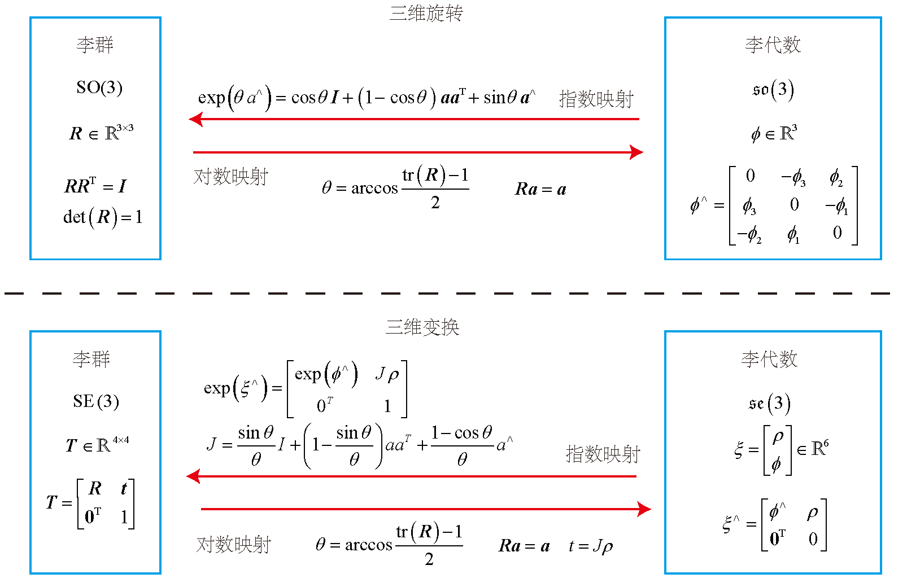
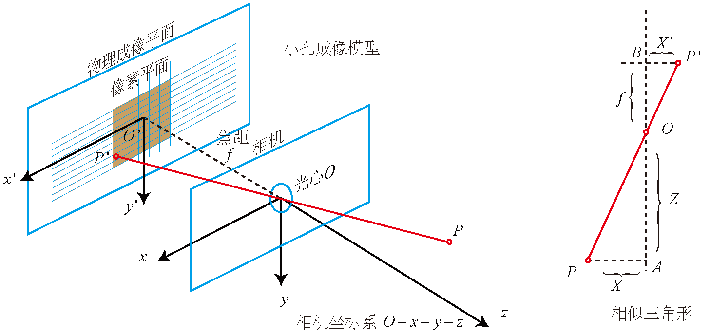
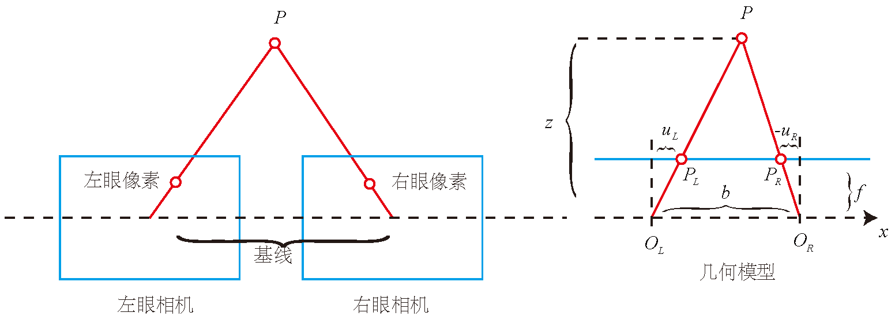

# Visual SLAM in 14 Lectures

[toc]


## 1. 预备知识

SLAM:搭载特定传感器的主体，在没有环境先验信息的情况下，于运动过程中建立环境的模型，同时估计自己的运动。If the sensor is camera, then it's called Visual SLAM.

1. Real-time
2. No prior knowledge

背景知识：射影几何，计算机视觉，状态估计理论，李群李代数

Related books

- Probabilistic robotics
- Multi View Geometry in Computer Vision
- State Estiamtion for Robotics: A Matrix-Lie-Group Approach

SLAM系统模块

- 视觉里程计 - Visual Odometry
- 后端优化
- 建图
- 回环检测

有用的库

- Eigen
- OpenCV
- PCL
- g2o
- Ceres

## 2. 初识SLAM

传感器

- 携带于机器人本体：轮式编码器（轮子转动角度），相机，激光雷达，GPS，IMU（角速度和加速度）
- 安装于环境中：导轨，二维码

SLAM中非常强调未知环境

相机

- 单目（Monocular)
- 双目（stereo)
- 深度（RGB-D）

照片本质上是拍照时的场景（Scene）在相机的成像平面上留下的投影。它*以二维的形式反映了三维的世界*。这个过程中丢掉了*深度*。

在Monocular SLAM，移动相机来估计它的运动（motion)，同时估计场景中物体的远近和大小（structure)。相机移动时，物体在图像上的运动形成了*视差*。

Monocular SLAM估计的轨迹和地图与真实的轨迹和地图相差一个因子，即所谓的尺度(Scale)。由于单目SLAM无法仅凭图像确定真实的尺度，又成为*尺度不确定性*。平移计算深度，无法确定尺度。

双目与深度相机测量深度的原理不同：

- 双目相机由两个单目组成，两个相机之间的距离-基线（Baseline）是已知的。通过这个基线来估计每个像素的空间位置，与人眼相似。多目相机与双目没有本质区别。双目需要大量计算才能（不太可靠的）估计每个像素点的深度。双目相机测量的深度与基线相关。基线距离越大，能够测量的范围越远，所以无人车上的双目都很大。

  双目（多目）的主要缺点是配置与标定复杂，深度量程和精度受双目的基线与分辨率所限。

  计算非常消耗资源。*计算量是双目的主要问题之一*

- RGB-D通过红外结构光或Time-of-Flight(ToF)原理，像激光传感器那样，通过主动向物体发射光并接收返回的光，测出物体与相机之间的距离。

  Kinect/Kinect v2, Xtion Pro Live, RealSense

  缺点：测量范围窄、噪声大、视野小、易受日光干扰、无法测量透射材质

### Visual SLAM Framework


1. 传感器信息读取 - 相机图像读取和预处理；码盘，IMU
2. 视觉里程计（Visual Odometry）- 估算相邻图像间相机的运动，以及局部地图的样子 Front End
3. 后端优化（Optimization）- 后端接受不同时刻视觉里程计测量的相机位姿，以及回环检测的信息，对它们进行优化，得到全局一致的轨迹和地图 Back End
4. 回环检测 （Loop Closing）- 判断机器人是否到达过先前的位置。如果检测到回环，它会把信息提供给后端处理
5. 建图（Mapping）- 根据估计的轨迹，建立与任务要求对应的地图

经典算法已定型，并且在许多视觉程序库和机器人程序库中提供。**如果把工作环境限定在静态、刚体，光照变化不明显、没有人为干扰的场景**，SLAM已经相当成熟。

图像在计算机里只是一个数值矩阵（理解图像-Machine Learning）。为了定量的估计相机运动，必须先了解相机与空间点的几何关系。

Visual Odometry是SLAM的关键。然而，通过VO来估计轨迹，将不可避免的出现**累计漂移（Accumulating Drift）**

后端优化主要处理SLAM过程中的**噪声**问题。如何从有噪声的数据中估计整个系统的状态，以及这个状态估计的不确定性有多大 - 最大后概率估计（Maximum-a-Posteriori， MAP）

在视觉SLAM中，前端和计算机视觉更相关，比如图像的特征提取与匹配，后端则主要是滤波和非线性优化算法。

后端SLAM是个状态估计问题 - **对运动主体自身和周围环境空间不确定性的估计**

SLAM方案：通过状态估计理论吧定位和建图的不确定性表达出来，然后采用滤波器或非线性优化，估计状态的均值和不确定性（方差）

回环检测（Loop Closure Detection）- 主要解决位置估计随时间漂移的问题。让机器人具有**识别到过的场景**的能力。可以判断图像的相似性来完成回环检测。视觉回环检测实际上是一种计算图像数据相似性的算法。

建图- 地图的构建没有固定的形式和算法，例如2D栅格，2D拓扑，3D点云，3D网格。可以分为度量地图（Metric）和拓扑地图（Topological）两种：

- 度量地图强调精确地表示地图中物体的位置关系。对于定位，稀疏路标地图足够了，导航则需要稠密的地图。2D小格子Grid，3D小方块Voxel。一个小块有占据、空闲、未知三种状态。A\*, D\* algorithm
- 拓扑地图更强调地图元素之间的关系。Graph，只考虑节点间的连通性

### SLAM问题的数学表述 

运动与观测

​														$$x_k=f(x_{k-1},u_k,\omega_K)$$

​														$$z_{k, j}=h(y_j, x_k, v_{k,j})$$

$u_k$ - 运动传感器输入，$\omega_k$ - 运动噪声， $y_j$ - 路标， $v_{k,j}$ - 观测噪声。描述：当知道运动测试的读数$u$以及传感器的读数$z$时，如何求解定位问题（估计$x$)和建图问题（估计$y$）？SLAM问题建模为一个状态估计问题：如何通过带有噪声的测量数据，估计内部的、隐藏的状态变量。

视觉SLAM，传感器是相机，那么观测方程就是“对路标点拍摄后，得到图像中的元素”的过程。这个过程牵涉到相机模型的描述。

> 按照运动和观测方程是否为线性、噪声是否服从高斯分布来分类，分为线性/非线性和高斯/非高斯系统。
>
> - 线性高斯LG的无偏的最优估计由Kalman Filter给出
> - 非线性非高斯系统，以EKF和非线性优化两大类方法求解。EKF把系统线性化，以预测-更新两大步骤求解。为了克服EKF的缺点（线性化误差和噪声高斯分布的假设），使用粒子滤波Particle Filter
> - 现在，视觉SLAM以图优化Graph Optimization为主流技术进行状态估计。**优化技术已经明显优于滤波器技术**，只要计算资源允许，应该使用优化方法

### 实践：编程基础

Linux中，程序是具有执行权限的文件，可以是脚本或者二进制文件，不过不像windows那样限制后缀名。

CMake: 后面的大多数库都使用cmake来管理源代码。In a cmake project

- 用cmake命令生成一个makefile文件
- 用make命令根据这个makefile文件的内容编译整个工程

步骤

1. 遵循cmake语法，建立CMakeLists.txt文件（我用Sublime CMake package）

```c++
# declare minimum cmake version reqirement
cmake_minimum_required(VERSION 2.8 FATAL_ERROR)

# declare a cmake project
#project(helloSLAM VERSION 0.1.0 LANGUAGES CXX and/or C)
project(helloSLAM)

# add executable
add_executable(helloSLAM helloSLAM.cpp)
```

2. 工程分析
   1. 自动生成以下中间文件- CMakeFiles folder, Makefile, cmake_install.cmake, CMakeCache.txt
   2. MakeFile是最重要的-一个自动化编译的脚本，可以理解成系统自动生成的编译指令

```C++
camke .
```

3. 编译 - 生成可执行文件

```c++
make
```

4. 测试执行

```c++
./helloSLAM
```

cmake-make

- cmake过程中处理了工程文件之间的关系
- make过程实际调用了个g++来编译程序

处理中间文件

```c++
mkdir build  // 中间文件都存在build文件夹中，build后可直接删除
cd build
cmake ..
make
```


使用库：只有带有main函数的文件才会生成可执行程序。其他算法、程序的集合代码，往往打包成一个库。

```c++
add_library(hello libHelloSLAM.cpp)  // 静态库
add_library(hello_shared SHARED libHelloSLAM.cpp)  // 共享库（.so in Linux, .dll in Windows)
```

Linux中，库文件分为静态库和共享库（.a, .so; windows中，.lib, .dll)。所有库都是一些函数打包后的集合，差别在于静态库每次被调用都会生成一个副本，而共享库则只有一个副本。

库文件就是一个压缩包，里面有编译好的二进制函数。对于使用者，只要拿到头文件和库文件，就可以调用这个库了。

```c++
add_executable(useHello useHello.cpp)
target_link_libraries(useHello hello_shared)  // 链接可执行到库文件
```

在IDE中调试

```c++
set(CMAKE_BUILD_TYPE "Debug")
```


## 3. 三维空间刚体运动

Eigen提供了C++中矩阵计算，它的Geometry模块提供了四元数等刚体运动的描述。

$$a \times b = a^\wedge b$$

相机运动是一个刚体运动，它保证了同一个向量在各个坐标系内的长度和夹角都不会发生变化。具状矩阵$R$ 由两组基之间的内积组成，刻画了旋转前后同一个向量的坐标变换关系。

$SO(n)$是特殊正交群（Special Orthogonal Group）。$SO(3)$就是三维空间的旋转。

齐次坐标的变换矩阵$T$, 引入了一个额外的自由度，但是把非线性变换变成了线性计算。特殊欧式群（Speical Euclidean Group）

**Eigen**

Eigen是一个纯头文件搭建起来的库，不需要链接库文件（没有）

Eigen与MATLAB类似，几乎所有的数据都当作矩阵来处理。Eigen不支持自动类型转化（implicit cast），比如float，double相加会报错。

### 旋转向量与欧拉角（Rotation vector & Euler angles）

Rotationi matrix and Transformation matrix are redundance, it's hard to estimate or optimize.

旋转向量（Axis-Angle）实际上就是李代数。从旋转向量到旋转矩阵的转换，通过罗德里格斯公式（Rodrigues's Formula）

​											          $$\boldsymbol{R} = cos(\theta)\boldsymbol{I}+(1-cos(\theta))\boldsymbol{nn}^T+sin\theta \boldsymbol{n}^\wedge$$

​																	$$\theta = arccos(\frac{tr(\boldsymbol{R})-1}{2})$$

​																		$$\boldsymbol{Rn}=\boldsymbol{n}$$

由于转轴上的向量在旋转后不发生改变，转轴$n$是矩阵$R$特征值为1对应的特征向量（求解后再归一化）。

欧拉rpy的旋转顺序是zyx（临时轴）。Euler Angles的一个缺点是万向锁问题Gimbal Lock:在俯仰角为$\pm90^\circ$时，第三次旋转与第一次旋转将使用同一个轴，使得系统丢失了一个自由度-奇异性问题（singularity）。**由于这个原理，欧拉角不适于插值和迭代，也不会在滤波和优化中使用**。

### 四元数

可以证明，我们找不到**不带奇异性的三维向量表示方式**。四元数（Quaternion）既是紧凑的也没有奇异性。

​													$$\boldsymbol{q}=q_0+q_1i+q_2j+q_3k=[s, \boldsymbol{v}]$$

四元数与旋转向量的关系

​													$$\boldsymbol{q}=[cos\frac{\theta}{2}, n_xsin\frac{\theta}{2}, n_ysin\frac{\theta}{2}, n_zsin\frac{\theta}{2}]^T$$

​											    	$$\begin{cases}\theta=2arccos(q_0) \\ [n_x, n_y, n_z]^T = [q_1, q_2, q_3]^T/sin\frac{\theta}{2} \end{cases}$$

”转了一半“。在四元数中，任意的旋转都可以由两个互为相反数的四元数表示。

**四元数表示旋转**

一个三维空间点可以用一个虚四元数表示 $$\boldsymbol{p}=[0, x, y, z]=[0, \boldsymbol{v}]$$, then $p'=qpq^{-1}$, where $q=[cos\frac{\theta}{2}, \boldsymbol{n}sin\frac{\theta}{2}]$

四元数到旋转矩阵

​									$$\boldsymbol{R}=\begin{bmatrix}1-2q_2^2-2q_3^2&2q_1q_2-2q_0q_3&2q_1q_3+2q_0q_2\\2q_1q_2+2q_0q_3&1-2q_1^2-2q_3^2&2q_2q_3-2q_0q_1\\2q_1q_3-2q_0q_2&2q_2q_3+2q_0q_1&1-2q_2^2-2q_2^2\end{bmatrix}$$

​								$$q_0=\frac{\sqrt{tr(\boldsymbol{R})+1}}{2}, q_1=\frac{m_{23}-m_{32}}{4q_0}, q_2=\frac{m_{31}-m_{13}}{4q_0}, q_3=\frac{m_{12}-m_{21}}{4q_0}$$

由于$\boldsymbol{q}， -\boldsymbol{q}$表示同一旋转，事实上$\boldsymbol{R}$对应的四元数并不是唯一的。编程中，当$q_0$接近0时，其余3个分量会非常大，解不稳定。

### 相似、仿射、射影变换

**相似变换**-缩放

$$\boldsymbol{T}_S = \begin{bmatrix}s\boldsymbol{R}&\boldsymbol{t}\\ \boldsymbol{0}^T&1\end{bmatrix}$$

**仿射变换**

$$\boldsymbol{T}_A = \begin{bmatrix}\boldsymbol{A}&\boldsymbol{t}\\ \boldsymbol{0}^T&1\end{bmatrix}$$

仿射变换之要求$\boldsymbol{A}$可逆，而不必正交。仿射变换也叫正交投影。经过仿射变换后，立方体不再是方的，但各个面仍然是平行四边形。

**射影变换**

$$\boldsymbol{T}_P = \begin{bmatrix}\boldsymbol{A}&\boldsymbol{t}\\ \boldsymbol{a}^T&v\end{bmatrix}$$

射影变换是最一般的变换。$\boldsymbol{A}$可逆，$\boldsymbol{t}$为平移，$\boldsymbol{a}^T$为缩放，$v=0/1$。因此，2D有8个自由度，3D有15个自由度。

从真实世界到相机照片的变换可以看成一个射影变换：方形不再是方形，甚至不是平行四边形。而是一个不规则的四边形。

| 变换           | 矩阵形式                                                     | 自由度 | 不变性质             |
| -------------- | ------------------------------------------------------------ | ------ | -------------------- |
| Euler          | $$\begin{bmatrix}\boldsymbol{R}&\boldsymbol{t}\\ \boldsymbol{0}^T&1\end{bmatrix}$$ | 6      | 长度、夹角、体积     |
| 相似           | $$\begin{bmatrix}s\boldsymbol{R}&\boldsymbol{t}\\ \boldsymbol{0}^T&1\end{bmatrix}$$ | 7      | 体积比               |
| 仿射Affine     | $$\begin{bmatrix}\boldsymbol{A}&\boldsymbol{t}\\ \boldsymbol{0}^T&1\end{bmatrix}$$ | 12     | 平行性、体积比       |
| 射影Projective | $$\begin{bmatrix}\boldsymbol{A}&\boldsymbol{t}\\ \boldsymbol{a}^T&v\end{bmatrix}$$ | 15     | 接触平面的相交和相切 |

> 如果相机的焦距为无穷远，变换为仿射变换

> Eigen's Geometry module provides two different kinds of geometric transformations:
>
> - Abstract transformations, such as rotations (angle-aixs, quaternion), translations, scalings. These transformations are not represented as matrices, but we can nevertheless mix them with matrices and vectors in expressions and conversion
> - Projective or affine transformation matrices: Transform class. These are really matrices

https://eigen.tuxfamily.org/dox/group__TutorialGeometry.html#TutorialGeoTransform

实际中，我们至少定义两个坐标系：**世界坐标系**和**相机坐标系**

$$\boldsymbol{p}_c=^cT_w\boldsymbol{p}_w$$

实践当中，$^cT_w$更常见，而$^wT_c$更直观。

## 4. 李群与李代数

把估计**什么样的相机位姿最符合当前观测数据**这样的问题构建为一个**优化**求解问题。旋转矩阵$\boldsymbol{R}$本身是带有约束的，不适合优化。

$\boldsymbol{R}$, $\boldsymbol{T}$对加法是不封闭（$\boldsymbol{R_1}+\boldsymbol{R_2} \notin SO(3)$）的，但是对乘法是封闭的。

群是一种集合加上一种运算的代数结构。满足一下条件：

1. 封闭性：$\forall a_1, a_2 \in A, a_1*a_2 \in A$
2. 结合律：$\forall a_1, a_2, a_3 \in A, (a_1*a_2)*a_3 = a_1*(a_2*a_3)$
3. 幺元：$\exist a_0 \in A, s.t. \forall a \in A, a_0*a=a*a_0=a$
4. 逆：$\forall a \in A, \exist a^{-1} \in A, s.t. a*a^{-1} = a_0$

李群是指具有连续（光滑）性质的群。每个李群都有一个李代数。

对于任意的向量$\boldsymbol{a}$有一个对应的反对称矩阵$\boldsymbol{A}$

$\boldsymbol{a}^\wedge = \boldsymbol{A}; \boldsymbol{A}^\vee = \boldsymbol{a}$

我们可以找到$\phi(t)$

$\dot{R}(t)R(t)^T=\phi(t)^\wedge$

so we further have

$\dot{R}(t)=\phi(t)^\wedge R(t) = \begin{bmatrix} 0 & -\phi_3 & \phi_2 \\\phi_3 & 0 & -\phi_1 \\ -\phi_2 & \phi_1 & 0\end{bmatrix}R(t)$

每对旋转矩阵求一次导数，只需左乘一个$\phi(t)^\wedge$矩阵即可。

把$R(t)$在$t_0=0$附近一阶泰勒展开

$R(t)=R(t_0)+\dot{R}(t)(t-t_0)=R(t_0) +\phi(t_0)^\wedge R(t_0)(t-t_0) = I + \phi(t_0)^\wedge(t)$

$\phi$反映了$R$的导数性质，所以称它在$SO(3)$原点附近的正切空间（Tangent Space）上

令$\phi(t_0)=\phi_0$, we have

$\dot{R}(t)=\phi_0^\wedge R$

求解关于$R$的微分方程，已知$R(0)=I$

$R(t) = exp(\phi_0^\wedge)(t)$

note:以上只对$t=0$附近有效。

旋转矩阵$\boldsymbol{R}$与另一个反对称矩阵$\phi_0^\wedge$通过指数关系发生了联系。$\phi$描述了$\boldsymbol{R}$在局部的导数关系。$\phi$正是对应到$SO(3)$上的李代数$so(3)$。$exp(\phi^\wedge)$反映的正是李群与李代数之间的指数/对数映射。

每个李群都有与之对应的李代数。李代数描述了李群的局部性质。李代数由一个集合$V$，一个数域$F$和一个二元运算$[,]$（李括号）组成。李代数$(V,F,[,])$具有如下性质: 封闭性，双线性，自反性，雅可比等价。三维向量上的叉积x是一个李括号。


$SO(3)$对应的三维向量李代数$\phi$的李括号为

$[\phi_1,\phi_2]=(\Phi_1\Phi_2-\Phi_2\Phi_1)^\vee$

在不引起歧义的情况下，对三维向量和所对应的三维反对称矩阵不加区别

$so(3)=\{\phi\in R^3, \Phi=\phi^\wedge \in R^{3\times3}\}$

$SE(3)$对应的李代数$se(3)$位于$R^6$空间

$se(3)=\{\xi=\begin{bmatrix}\rho \\ \phi \end{bmatrix} \in R^6, \rho \in R^3, \phi \in so(3), \xi^\wedge=\begin{bmatrix} \phi^\wedge & \rho \\ 0^T & 0\end{bmatrix} \in R^{4 \times 4}\}$

$\xi$前三维为平移（但含义与变换矩阵中的平移不同），后三维为旋转。$^\wedge, ^\vee$表示“从向量到矩阵”和“从矩阵到向量“的关系（并不一定是反对称）。$se(3)$的李括号为

$[\xi_1,\xi_2]=(\xi_1^\wedge\xi_2^\wedge-\xi_2^\wedge\xi_1^\wedge)^\vee$

### 指数与对数映射

$exp(\phi^\wedge)$被称为指数映射(Exponential Map)。

$$exp(\phi^\wedge)=exp((\theta \boldsymbol{a})^\wedge)=exp(\theta a^\wedge)=\sum_{n=0}^{\infty}\frac{1}{n!}(\theta a^\wedge)^n = I + \theta a^\wedge + \frac{1}{2!}\theta^2a^\wedge a^\wedge+\frac{1}{3!}\theta^3a^\wedge a^\wedge a^\wedge+\frac{1}{4!}\theta^4a^\wedge a^\wedge a^\wedge a^\wedge+...$$

we can prove

$a^\wedge a^\wedge = aa^T-I$

$a^\wedge a^\wedge a^\wedge = -a^\wedge$

$$exp(\phi^\wedge)=aa^T-a^\wedge a^\wedge+(\theta-\frac{1}{3!}\theta^3+\frac{1}{5!}\theta^5-...)-(-\frac{1}{2!}\theta^2+\frac{1}{4!}\theta^4-...)a^\wedge a^\wedge \\ =a^\wedge a^\wedge+I+sin\theta a^\wedge-cos\theta a^\wedge a^\wedge \\ =(1-cos\theta)a^\wedge a^\wedge + I + sin\theta a^\wedge \\ = cos\theta I + (1-cos\theta)aa^T+sin\theta a^\wedge$$

这个式子与罗德里格斯公式一致$R = cos\theta I + (1-cos\theta)aa^T+sin\theta a^\wedge$。这表明$so(3)$实际上就是由所谓的旋转向量组成的空间，而指数映射即罗德里格斯公式。通过它们，我们把$so(3)$中任意一个向量对应到一个位于$SO(3)$的旋转矩阵。反之，通过对数映射也能把$SO(3)$对应到$so(3)$。不过通常不通过泰勒展开来计算对数映射

指数映射是一个满射，存在一对多的情况。如果把旋转角度固定在$\pm\pi$之间，那么李群和李代数是一一对应的。


**SE(3)上的指数映射**

$$exp(\xi^\wedge)=\begin{bmatrix}\sum_{n=0}^{\infty}\frac{1}{n!}(\phi^\wedge)^n & \sum_{n=0}^{\infty}\frac{1}{(n+1)!}(\phi^\wedge)^n\rho \\ O^T & 1\end{bmatrix} \\ \triangleq \begin{bmatrix}R & J\rho \\ 0^T & 1\end{bmatrix}=T$$

where $J=\frac{sin\theta}{\theta}I+(1-\frac{sin\theta}{\theta})aa^T+\frac{1-cos\theta}{\theta}a^\wedge$

$t=J\rho$ and $J$可以由$\phi$得到。

总结图：



### 李代数求导与扰动模型

李代数求导与近似形式**

使用李代数的一大动机是进行优化。遗憾的是

$exp(\phi_1^\wedge)exp(\phi_2^\wedge)=exp((\phi_1+\phi_2)^\wedge)$是不成立的

线性化BCH公式，可以近似表达为

$ln(exp(\phi_1^\wedge)exp(\phi_2^\wedge))^\vee \approx \begin{cases} J_l(\phi_2)^{-1}\phi_1+\phi_2 & 当\phi_2为小量，左乘 \\ J_r(\phi_1)^{-1}\phi_2+\phi_1 & 当\phi_2为小量，右乘\end{cases}$

解读：当一个旋转矩阵$R_2$（李代数为$\phi_2$）左乘一个微小旋转矩阵$R_1$（李代数为$\phi_1$）时，可以近似的看作，在原有的李代数$\phi_2$上加上了一项$J_l(\phi_2)^{-1}\phi_1$。同理，第二项描述了右乘一个微小位移的情况。李代数在BCH近似下，分成了左乘近似和右乘近似两种。

左乘BCH近似雅可比前面见过

$J_l=J=\frac{sin\theta}{\theta}I+(1-\frac{sin\theta}{\theta})aa^T+\frac{1-cos\theta}{\theta}a^\wedge$

逆

$J_l^{-1}=\frac{\theta}{2}cot\frac{\theta}{2}I+(1-\frac{\theta}{2}cot\frac{\theta}{2})aa^T-\frac{\theta}{2}a^\wedge$

右乘雅可比仅需要对自变量取负号即可

$J_r(\phi)=J_l(-\phi)$

李群乘法与李代数加法的关系

$\Delta R \cdot R=exp(\Delta \phi^\wedge)exp(\phi^\wedge)=exp((\phi+J_l^{-1}(\phi)\Delta \phi)^\wedge)$

反之，在李代数上进行加法

$exp((\phi + \Delta \phi)^\wedge)=exp((J_l\Delta\phi)^\wedge)exp(\phi^\wedge)=exp(\phi^\wedge)exp((J_r\Delta \phi)^\wedge)$


**SO(3)上的李代数求导**

SO(3)是冗余的矩阵，不容易优化。李代数具有良好的加法运算。使用李代数解决求导问题分两种：

1. 对李代数求导
2. 对里群左乘或右乘微小扰动，然后对该扰动求导

$$\frac{\partial(exp(\phi^\wedge)p)}{\partial\phi}= \lim_{\delta x->0}\frac{exp((\phi+\delta \phi)^\wedge)p-exp(\phi^\wedge)p}{\delta\phi}\\=\lim_{\delta\phi->0}\frac{\exp((J_l\delta\phi)^\wedge)exp(\phi^\wedge)p-exp(\phi^\wedge)p}{\delta\phi} \\ = \lim_{\delta\phi->0}\frac{(I+(J_l\delta\phi)^\wedge)exp(\phi^\wedge)p-exp(\phi^\wedge)p}{\delta\phi}\\=\lim_{\delta_\phi->0}\frac{(J_l\delta\phi)^\wedge exp(\phi^\wedge)p}{\delta\phi}\\=\lim_{\delta\phi->0}\frac{-(exp(\phi^\wedge)p)^\wedge J_l\delta\phi}{\delta\phi}\\=-(Rp)^\wedge J_l$$

左乘扰动

$$\frac{\partial(Rp)}{\partial\varphi}=\lim_{\varphi->0}\frac{exp(\varphi^\wedge)exp(\phi^\wedge)p-exp(\phi^\wedge)p}{\varphi}\\=\lim_{\varphi->0}\frac{(I+\varphi^\wedge)exp(\phi^\wedge)p-exp(\phi^\wedge)p}{\varphi}\\=\lim_{\varphi->0}\frac{\varphi^\wedge Rp}{\varphi}\\=\lim_{\varphi->0}\frac{-(Rp)^\wedge \varphi}{\varphi}=-(Rp)^\wedge$$

相比较直接求导，省去了一个雅可比$J_l$的计算，扰动模型更为实用。


**SE(3)上的扰动模型**李代数求导

扰动项的李代数为$\delta\xi=[\delta\rho, \delta\phi]^T$

$$\frac{\partial(Tp)}{\partial\delta\xi}=\lim_{\delta\xi->0}\frac{exp(\delta\xi)^\wedge exp(\xi^\wedge) p - exp(\xi^\wedge)p}{\delta\xi}\\=\lim_{\delta\xi->0}\frac{\delta\xi^\wedge exp(\xi^\wedge)p}{\delta\xi}\\=\lim_{\delta\xi->0}\frac{\begin{bmatrix} \delta\phi^\wedge & \delta\rho \\ O^T & 0\end{bmatrix}\begin{bmatrix} Rp+t \\ 1\end{bmatrix}}{\delta\xi}\\=\lim_{\delta\xi->0}\frac{\begin{bmatrix} \delta\phi^\wedge(Rp+t)+\delta\rho \\ 0^T\end{bmatrix}}{[\delta\rho, \delta\phi]^T}\\=\begin{bmatrix} I & -(Rp+t)^\wedge \\ 0^T & 0^T\end{bmatrix} \overset{def}{=} (Tp)^\bigodot $$

最后一个自定义算符$\bigodot$把一个齐次空间坐标点变换为一个$4\times6$矩阵。

### 相似变换群与李代数

单目视觉中使用的相似变换群Sim(3)，及对应李代数sim(3)

单目中存在尺度不确定性与尺度漂移。

$Sim(3) = \{S = \begin{bmatrix} sR & t \\ 0^T & 1\end{bmatrix} \in R^4\}$

李代数$sim(3)$元素是一个7维向量$\zeta$, 前6维与$se(3)$相同

$$sim(3) = \{\zeta|\zeta=\begin{bmatrix}\rho \\ \phi \\ \sigma\end{bmatrix} \in R^7, \zeta^\wedge = \begin{bmatrix} \sigma I +\phi^\wedge & \rho \\ 0^T & 0 \end{bmatrix} \in R^{4\times 4}\}$$

关联$Sim(3), sim(3)$的仍是指数映射和对数映射。

$$exp(\zeta^\wedge)=\begin{bmatrix}e^\sigma exp(\phi^\wedge) & J_s\rho \\ 0^t & 1\end{bmatrix}$$

$$J_s=\frac{e^\sigma-1}{\sigma}I+\frac{\sigma e^\sigma sin\theta+(1-e^\sigma cos\theta)\theta}{\sigma^2+\theta^2}a^\wedge+(\frac{e^\sigma-1}{\sigma}-\frac{(e^\sigma cos\theta-1)\sigma +(e^\sigma sin\theta)\theta}{\sigma^2+\theta^2})a^\wedge a^\wedge$$

符号的对应关系是

$s=e^\sigma, R=exp(\phi^\wedge), t = J_s\rho$

BCH与扰动模型类似


实践：Sophus

sophus is a small library, generally don't need to be installed and could be integrated in the project. In case of not finding the sophus header file

1. use "make install" instead of "make"
2. find_package  是寻找SophusConfig.cmake文件，这里面说明了你的Sophus库安装在哪里，如果只是make了，没有make  install，那把Sophus的目录就放在当前项目根目录中，这个工程中的find_package会在当前目录中找这个配置文件。可以specify include_directories, link_libraries

Prove $Rp^\wedge R^T = (Rp)^\wedge$:

for any 3D vector $u$, we have $(Rp)^\wedge Ru = (Rp)\times (Ru) = R(p\times u)=Rp^\wedge u = Rp^\wedge (R^TR)u = (Rp^\wedge R^T)Ru \\ \Rightarrow ((Rp)^\wedge - Rp^\wedge R^T)Ru = 0 \Rightarrow Rp^\wedge R^T = (Rp)^\wedge$

## 5. 相机与图像

对视觉SLAM，观测主要是指相机成像的过程。

由于相机镜头中透镜的存在，使得光线投影到成像平面的过程中会产生**畸变**。用针孔模型和畸变模型来描述投影过程。

### 相机模型



物理成像关系

$$\frac{Z}{f}=-\frac{X}{X'}=-\frac{Y}{Y'} \\ \Rightarrow X' = \frac{X}{Z}f, Y' = \frac{Y}{Z}f$$

负号表示成像是倒立的。

**图像/像素坐标系**

设在物理成像平面上固定着一个像素平面$o-u-v$

像素坐标系：原点$o'$位于图像的左上角，$u$轴向右与$x$轴平行，$v$轴向下与$y$轴平行。*像素坐标系与成像平面之间相差了一个缩放和一个原点的平移*

$P'$与像素坐标$[u,v]^T$的关系为

$$\begin{pmatrix}u \\ v \\ 1 \end{pmatrix}=\begin{pmatrix} \alpha & 0 & c_x\\ 0 & \beta & c_y \\ 0 & 0 & 1\end{pmatrix} \begin{pmatrix} X' \\ Y' \\ 1\end{pmatrix}= \frac{1}{Z}\begin{pmatrix}f_x & 0 & c_x \\ 0 & f_y & c_y \\ 0 & 0 & 1\end{pmatrix} \begin{pmatrix}X \\ Y \\ Z \end{pmatrix} \triangleq \frac{1}{Z}KP$$

where $f_x = \alpha f, f_y = \beta f$; $\alpha, \beta$的单位是$pixel/m$ or $pixel/mm$

中间矩阵为**内参数矩阵**（camera intrinsics）$K$。通常认为，相机的内参在出厂后是固定的，不会在使用过程中发生变化。标定算法已经成熟（如著名的单目棋盘张正友标定法）。

上式的$P$表达在相机坐标系下，实际上相机在运动

$$ZP_{uv} = Z \begin{pmatrix}u \\ v \\ 1\end{pmatrix} = KP = K(RP_w+t)=KTP_w$$

$P_w$为相机位姿在世界坐标系下，$R, t$是相机的外参数（camera extrinsics）。相比于不变的内参，外参会随着相机运动发生改变，也是SLAM中待估计的目标，代表着机器人的轨迹。在机器人或自动驾驶中，外参有时也解释成相机坐标系到机器人坐标系的变换，描述”相机安装在什么位置“

投影过程可以理解为把一个世界坐标点先转换到相机坐标系，再除掉它最后一维的数值（即该点距离相机成像平面的深度），这相当于吧最后一维进行归一化处理，得到点P在相机归一化平面上的投影。归一化坐标可看成相机前方$z=1$处的平面上的一个点，这个平面也称为归一化平面。归一化坐标再左乘内参就得到了像素坐标。**点的深度在投影过程中丢失了**

#### 畸变模型

透镜自身的形状对光线传播的影响;组装中，透镜和成像平面不可能完全平行。

对于相机坐标系上的点P，通过5个畸变系数来修正镜像径向和切向distortion

$$\begin{cases} x_{distorted} = x(1+k_1r^2+k_2r^4+k_3r^6)+2p_1xy+p_2(r^2+2x^2) \\ y_{distorted} = y(1+k_1r^2+k_2r^4+k_3r^6)+p_1(r^2+2y^2)+2p_2xy\end{cases}$$

将畸变后的点通过内参数矩阵投影到像素平面，得到该点在图像上的正确位置。

在实际的图像系统中，还有其他很多的相机（仿射，透视）模型和畸变模型。对于SLAM中的普通相机，上述已经足够。

有两种畸变矫正（undistort）做法：1. 对图像去畸变，然后计算空间位置。2.从畸变的图像上的点出发，按照畸变方程，讨论畸变前的空间位置。前者更常见。


总结单目成像过程：

1. 世界坐标系下一个固定的点$P_w$
2. 由于相机在运动，相机坐标经变换$\tilde{P}_c=RP_w+t$
3. 把$\tilde{P}_c$投影到归一化平面$Z=1$上，$P_c=[X/Z, Y/Z, 1]^T$
4. 有畸变时，根据畸变参数计算$P_c$发生畸变后的坐标
5. P的归一化坐标经过内参后，对应到它的像素坐标: $P_{uv}=KP_c$

世界坐标，相机坐标，归一化坐标和像素坐标

#### 双目相机模型

单目深度信息缺失，从相机光心到归一化平面连线上的所有点，都可以投影到一个像素上。

双目相机与人眼原理相似：通过同步采集左右相机的图像，计算图像间视差，以便估计每一个像素的深度。



考虑一个空间点P，它在左右眼相机各成一像$P_L, P_R$。

$$z=\frac{fb}{d}, d\overset{def}{=}u_L-u_R$$

$d$被称为**视差**。根据视差，我们可以估计一个像素与相机之间的距离。视察与激励成反比：视差越大，距离越近。同时，由于视差最小为一个像素，于是双目的深度存在一个理论上的最大值，由$fb$确定。基线越长，双目能测到的最大距离就越远（人眼在看非常远的物体时，通常不能准确判断它的距离-基线有限）。

视差$d$的估计不算容易。确切地知道左眼图像的某个像素出现在右眼图像的哪一个位置（对应），属于“人类觉得容易而计算机觉得困难”的任务。而且只有在图像纹理变化丰富的地方才能计算视差。由于计算量的原因，双目深度估计仍需要使用GPU或FPGA来实现。

#### RGB-D相机模型

RGB-D原理

1. 红外机构光（Structured Light）：Kinect 1, Intel RealSense。通过红外结构光发射器和接收器，根据返回的结构光图案，计算物体与自身之间的距离。
2. 飞行时间（Time of Flight, ToF）：Kinect 2。通过脉冲光发射器和接收器，根据发送到返回之间的光束飞行时间，确定物体与自身的距离。ToF与激光传感器十分相似，激光是通过逐点扫描获取距离的，而ToF相机可以获得整个图像的像素深度。

完成深度与彩色图像素之间的配对后，我们可以在同一个图像位置，读取到色彩信息和距离信息，计算像素的3D相机坐标，生成点云（Point Cloud）。既可以在图像层面，也可以在点云层面处理。

红外光容易受到日光的干扰，不能在室外使用。对于透射材质的物体，接收不到反射光，无法测量。

### 图像

$$I(x,y):R^2 \mapsto R$$

```c++
unsigned char pixel = image[y][x];
```

一个像素数据

- 灰度图：0-255, 8 bits
- 深度图：0-65535, 16 bits
- 彩色图：RGB channels

OpenCV彩图的默认顺序是BGR

### 3D视觉

#### 双目

左右图像->视差图->像素在相机坐标系下的坐标->点云

我们调用了OpenCV实现的SGBM(Semi-Global Batch Matching)算法计算左右图像的视察，然后通过双目相机的几何模型把它变换到相机的3D空间中。SGBM使用了来自网络(?)的经典参数配置，我们主要调整了最大和最小视差。视差数据结合相机的内参、基线，即能确定各点在三维空间的位置。

#### RGB-D


## 6. 非线性优化

在有噪声的数据中进行准确的状态估计。

图优化

### 批量状态估计问题

**最大后验与最大似然**

运动方程与观测方程

$$\begin{cases} x_k=f(x_{k-1}, u_k)+w_k \\ z_{k,j} = h(y_j, x_k)+v_{k,j} \mapsto sz_{k,j} = K exp(\xi^\wedge)y_j \mapsto sz_{k,j} = K(R_k y_j + t_k)\end{cases}$$

我们通常假设运动和观测噪声满足零均值的高斯分布

$w_k \sim N(0, R_k), v_k \sim N(0, Q_{k,j})$

通过带有噪声的数据$z, u$推断位姿$x$和地图$y$（以及他们的概率分布），这构成了一个状态估计问题。

1. 增量/渐进 - 滤波器方法：持有一个当前的时刻的估计状态，用新的数据来更新
2. 批量（batch）方法：考虑从0时刻到当前的所有历史输入和观测数据

传统上EKF关系当前时刻的状态估计$x_k$而对之前的状态不多考虑；近年来，非线性优化方法，使用所有时刻采集到的数据进行状态估计，被认为优于传统的滤波器。batch的处理方法通常是**不实时**的，一些折中的手段是固定一些历史轨迹，仅对当前时刻附近的轨迹进行优化，这是**滑动窗口估计法**


在非线性优化中，把所有待估计的变量放在一个“状态变量”中，在已知输入数据$u$和观测数据$z$的条件下，计算状态$x$的条件概率分布$P(x|z, u)$。（2nd edition: 对机器人状态的估计，从概率学的观点看，就是已知输入数据$u$和观测数据$z$的条件下，求$x, y$的条件概率分布 $P(x,y|z, u)$)。特别地，当没有测量运动的传感器（不知道控制输入），而只有一张张的图像时，即只考虑观测方程带来的数据时，相当于估计$P(x|z)$或$P(x,y|z)$ 的条件概率分布。如果忽略图像在时间上的联系，该问题也称为Structure from Motion (SfM)，即如何从许多图像中重建三维空间结构。SLAM可以看作图像具有时间先后顺序，需要实时求解一个SfM问题。利用贝叶斯法则

$$P(x，y|z,u)=\frac{P(z,u|x,y)P(x,y)}{P(z,u)} \propto P(z,u|x,y)P(x,y)$$

where

- $P(x,y|z,u)$：后验概率 Posterior
- $P(z,u|x,y)$：似然 Likelihood
- $P(x,y)$：先验 Prior
- $P(z,u)$与待估计状态无关可以忽略

直接求后验概率分布时困难的，但是求一个状态最优估计，使得在该状态下后验概率最大化（Maximize a Posterior, MAP）是可行的：

$$(x,y)^*_{MAP}=arg\max P(x,y|z,u)=arg\max P(z,u|x,y)P(x,y)$$

以上可得**求解最大后验概率相当于最大化似然和先验的乘积**。如果不知道机器人位姿大概在什么位置，就没有了先验。此时，可以求解$x$的最大似然估计（Maximum Likelihood Estimation, MLE）

$(x,y)^*_{MLE}=arg\max P(z,u|x,y)$

直观上

- 似然：在现在的位姿下，可能产生怎样的观测数据
- 最大似然估计：在什么样的状态下，最可能产生现在观测到的数据


**最小二乘**

考虑单次观测的最大似然估计，可以使用**最小化负对数**来求一个高斯分布的最大似然。

由于对数函数是i单调递增的，对原函数求最大化相当于对负对数求最小化。

$$(x_k, y_k)^*=arg\max N(h(y_j, x_k), Q_{k, j}) \\ = arg\min(\frac{1}{2}(x-\mu)^T\sum^{-1}(x-\mu)) \\ = arg\min((z_{k,j}-h(x_k, y_j))^TQ_{k,j}^{-1}(z_{k,j}-h(x_k, y_j)))$$

该式等价于最小化噪声项（误差）的一个二次型（Mahalanobis distance）。也可以看成由$Q_{k,j}^{-1}$加权之后的欧式距离，$Q_{k,j}^{-1}$也叫做信息矩阵，即高斯分布协方差矩阵之逆。

我们可以独立地处理各时刻的运动和观测。最小化所有时刻估计值与真实读数之间的马式距离，等价于求最大似然估计。

$$min J(x,y)=\sum_k e_{u,k}^TR_k^{-1}e_{u,k}+\sum_k \sum_j e_{z,k,j}^T Q_{k,j}^{-1}e_{z,k,j}$$

- 目标函数由多个误差的加权二次型组成。每个误差项仅与一两个状态变量有关。稀疏形式
- 如果使用李代数表示增量，则该问题是无约束的最小二乘问题
- 误差的分布影响二次行误差度量在整个问题中的权重。例如，如果观测非常准确，那么协方差举证就会小，而信息矩阵就会大，误差项在目标函数的权重较高

### 非线性最小二乘

迭代寻找梯度并下降的过程。

$$\lVert f(x+\Delta x)\rVert_2^2 \approx \lVert f(x)\rVert_2^2+J(x)^T\Delta x + \frac{1}{2} \Delta x^T H \Delta x$$

Jacobian, Hessian matrix for 1st and 2nd order derivatives. 我们只需要关心$f$在迭代处的局部性质而非全局性质。

**Gauss-Newton Method**

$$f(x+\Delta x) \approx f(x) + J(x)^T\Delta x$$

$$\Delta x^* = arg\min_{\Delta x} \frac{1}{2} \lVert f(x)+J(x)^T\Delta x\rVert ^2$$

对$\Delta x$求导，并令其为零

$$J(x)f(x)+J(x)J^T(x)\Delta x = 0 \mapsto H(x)\Delta x = g(x)$$

这个方程是关于变量$\Delta x$的线性方程组，称为增量方程，或者正规方程(normal equation)。高斯牛顿法用$JJ^T$作为牛顿法中二阶Hessian矩阵的近似，从而省略了$H$的计算。**求解增量方程是整个优化问题的核心所在**

> 1. 初始值$x_0$
> 2. 对于k次迭代，求出当前的Jacobian$J(x_k)$和误差$f(x_k)$
> 3. 求解增量方程$H\Delta x_k = g$
> 4. 若$\Delta x_k$足够小，则停止。否则，令$x_{k+1}=x_k+\Delta x_k$，返回第二步

实际中$JJ^T$只有半正定性，可能为singular or ill-conditioned，导致算法不稳定。也有可能求出的$\Delta x$步长太大，无法收敛。

非线性优化领域，很多算法都是高斯牛顿法的变种。线性搜索法加入了一个步长，$\lVert f(x+\alpha \Delta x)\rVert^2$

列文伯格-马夸尔特被认为比高斯牛顿法更健壮(robust)，也被称为阻尼牛顿法。

**Levenberg-Marquardt (L-M) Method**

高斯牛顿法采用的近似二阶泰勒展开只能在展开点附近有较好的近似效果。可以给$\Delta x$添加一个范围（Trust Region）。在信赖区域，认为近似是有效的；出了区域，近似可能会有问题

改良版非线性优化框架

>1. 初始值$x_0$，以及初始优化半径$\mu$
>
>2. 对于k次迭代，在高斯牛顿法的基础上加上信赖区域，求解：
>
>   $min_{\Delta x_k} \frac{1}{2} \lVert f(x_k)+J(x_k)^T\Delta x_k \rVert ^2, s.t. \lVert D\Delta x_k \rVert ^2 \le \mu$
>
>3. 计算$\rho = \frac{f(x+\Delta x) - f(x)}{J(x)^T \Delta x}$来确定信赖区域的范围
>4. if $\rho > 3/4$, $\mu = 2\mu$
>5. if $\rho < 1/4$, $\mu = 0.5\mu$
>6. 如果$\rho$大于某阈值，则认为近似可行。令$x_{k+1}=x_k+\Delta x_k$
>7. 判断算法是否收敛，如不收敛则返回第2步，否则结束

马夸尔特提出将$D$取成非负数对角阵-实际中通常用$J^TJ$的对角元素平方根，是的在梯度小的维度上约束范围更大一些。

对带不等式约束的优化问题，用拉格朗日乘子把约束项放到目标函数中，构成拉格朗日函数

$$L(\Delta x_k, \lambda) = \frac{1}{2} \lVert f(x_k)+J(x_k)^T\Delta x_k \rVert ^2 + \frac{\lambda}{2}(\lVert D \Delta x_k \rVert ^2 - \mu)$$

令该拉格朗日函数关于$\Delta x$的导数为零，它的核心仍是计算增量的线性方程

$(H+\lambda D^T D)\Delta x_k = g$

简化形式当$D=I$

- $\lambda$较小时，$H$占主要地位，说明二次近似模型在该范围内是比较好的；列文伯格-马夸尔特更接近于高斯牛顿法
- $\lambda$较大时，$\lambda I$占据主要地位，说明附近的二次近似不够好；列文伯格-马夸尔特方法更接近与一阶梯度下降法（最速下降）

>- 最优化处理是基本数学工具，在深度学习等领域也有用
>- 非线性优化的所偶迭代求解方案，都需要用户提供一个良好的初始值；视觉SLAM中，通常用ICP，PnP之类的算法提供优化初始值
>- 如何求解线性增量方程组：视觉SLAM中，$\Delta x$的维度可一达到上千，甚至几十万的级别，对大矩阵求逆是不现实的。通常采用矩阵分解（QR， Cholesky)；利用SLAM特有的稀疏形式进行消元、分解。在很多开源的优化库上，维度为一万多的变量在一般计算机上可以在几秒甚至更短的时间内求解出来


## 7. 视觉里程计1

## 8. 视觉里程计2

## 9. 实践：设计前端

## 10. 后端1

## 11. 后段2

## 12. 回环检测

## 13. 建图

## 14. SLAM：现在与未来

## 附录