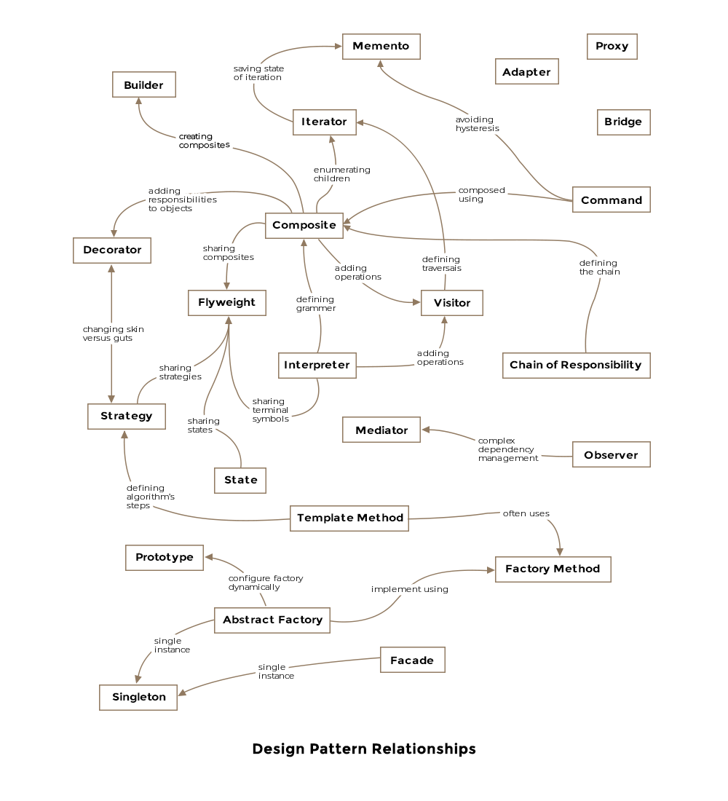

# Software Design Patterns: Best Practices for Software Developers

[toc]

## Introduction

Don't reinvent the wheel! Relationship among various design patterns by the gang of four

anti-patterns: how NOT to do things!

Suggestions for OOD:

- Separate out parts of code that vary or change from those that remain the same
- Always code to an interface and not against a concrete implementation
- Encapsulate behaviors as much as possible
- Favor composition over inheritance: Inheritance can result in explosion of classes and also sometimes the base class is fitted with new functionality that isn't applicable to some of its derived classes
- Interacting components within a system should be as loosely coupled as possible
- Ideally, class design should inhibit modification and encourage extension
- Using patterns in your day to day work, allows exchanging entire implementation concepts with other developers via shared pattern vocabulary

Flexibility increases complexity and understandability. One must walk a fine line between the two competing objectives when designing and writing software.

### Types of Design Patterns

- Creational: relate to how objects are constructed from classes.
  - Builder Pattern
  - Prototype Pattern
  - Singleton Pattern
  - Abstract Factory Pattern
- Structural: concerned with the composition of classes i.e. how the classes are made up or constructed
  - Adapter Pattern
  - Bridge Pattern
  - Composite Pattern
  - Decorator Pattern
  - Facade Pattern
  - Flyweight Pattern
  - Proxy Pattern
- Behavioral: dictate the interaction of classes and objects amongst each other and the delegation of responsibility
  - Interpreter Pattern
  - Template Pattern
  - Chain of Responsibility Pattern
  - Command Pattern
  - Iterator Pattern
  -  Mediator Pattern
  - Memento Pattern
  - Observer Pattern
  - State Pattern
  - Strategy Pattern
  - Visitor Pattern

For interview prep, go through all **creational patterns, decorator, proxy, iterator, observer and visitor** patterns. Be sure to look at the Java framework's api examples

## Creational Patterns

